# Empathy Ledger Data Flow & Relationships

**Visual guide to how data lives in the platform and connects across entities**

---

## 📊 Overview: The Data Ecosystem

### Core Entities

```
┌─────────────┐
│ Storyteller │ ──────────────────┐
│  (Profile)  │                   │
└─────────────┘                   │
                                  ▼
┌──────────────┐           ┌──────────┐           ┌─────────────┐
│ Organization │◄─────────►│  Story   │◄─────────►│   Project   │
└──────────────┘           └──────────┘           └─────────────┘
                                  │
                                  ▼
                           ┌─────────────┐
                           │  Transcript │
                           │   Analysis  │
                           └─────────────┘
                                  │
                    ┌─────────────┼─────────────┐
                    ▼             ▼             ▼
              ┌─────────┐   ┌─────────┐   ┌─────────┐
              │ Themes  │   │ Quotes  │   │Analytics│
              └─────────┘   └─────────┘   └─────────┘
```

---

## 🌳 Entity Relationship Diagram (Detailed)

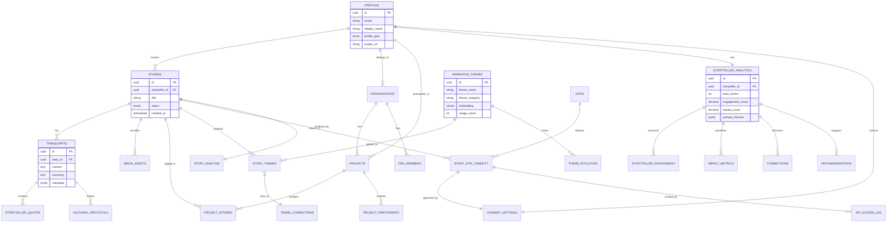

---

## 🔄 Data Flow: From Story Creation to Analysis

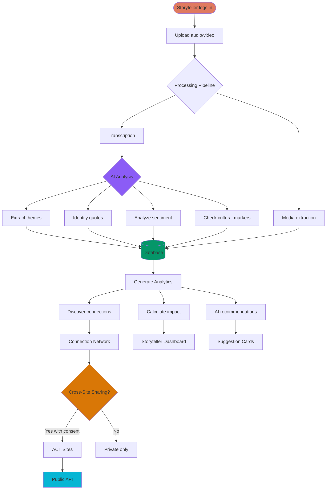

---

## 👤 Storyteller-Centric View

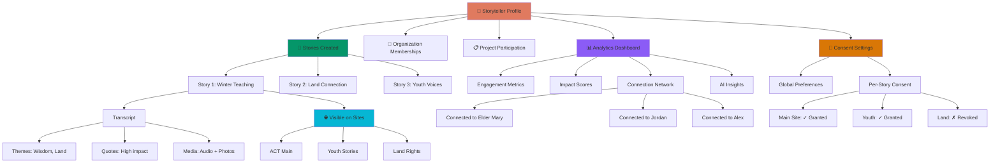

---

## 🏢 Organization → Projects → Stories Flow

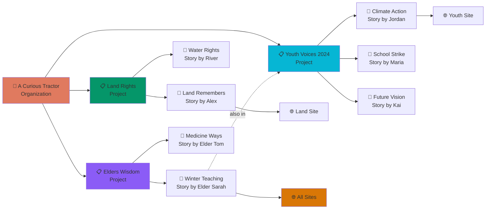

---

## 🎯 Thematic Analysis Network

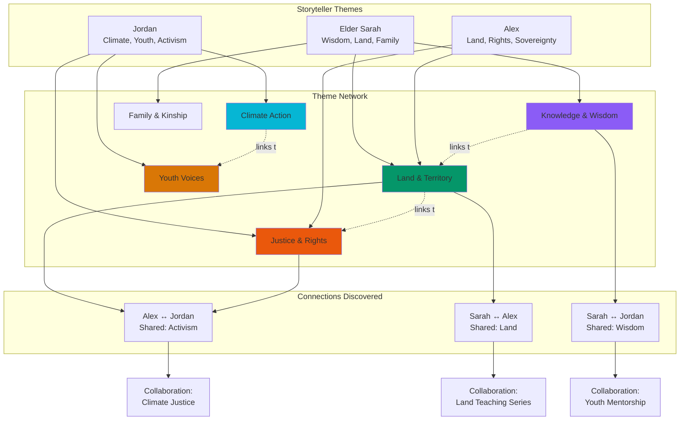

---

## 🔗 Story → Analysis → Insights Pipeline

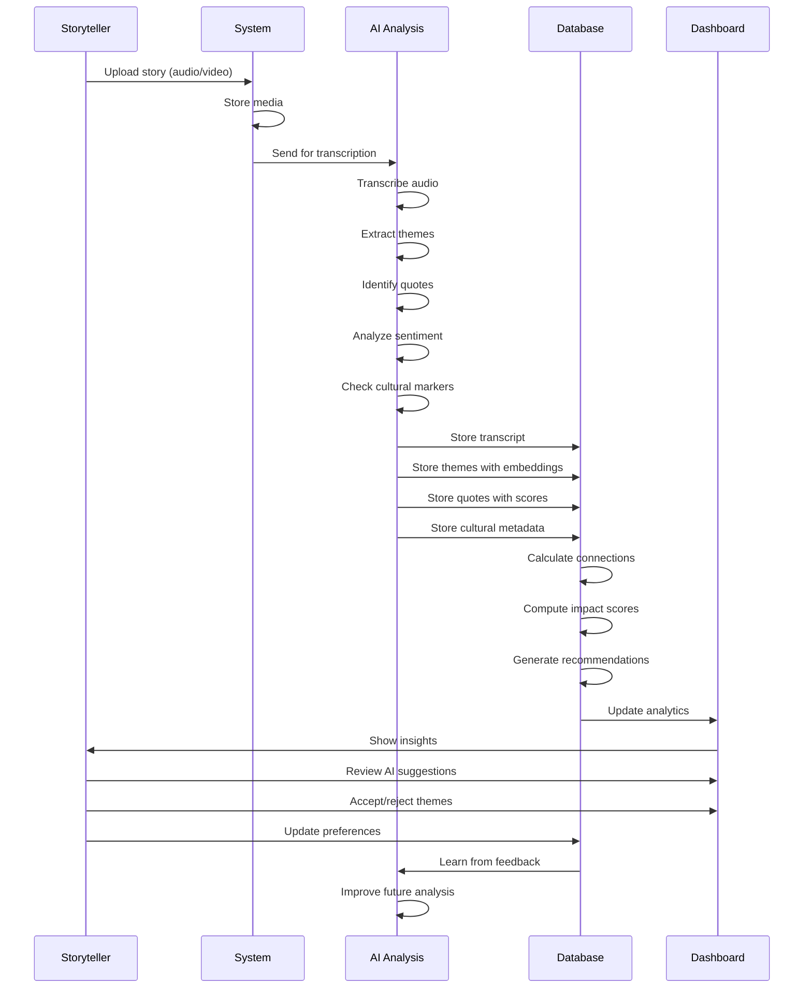

---

## 🌐 Cross-Site Story Sharing Flow

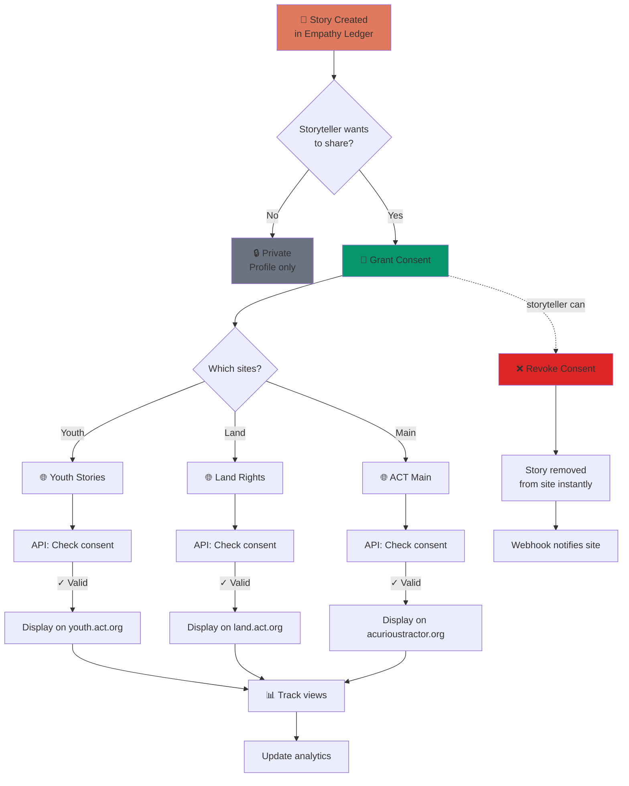

---

## 📊 Analytics Data Model

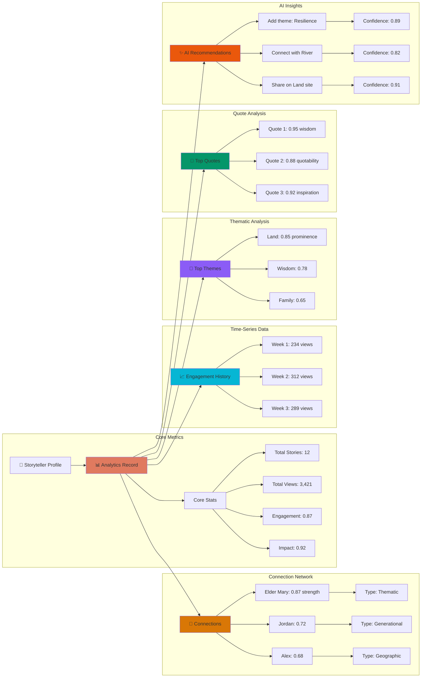

---

## 🎨 Theme Evolution & Cross-Narrative Insights

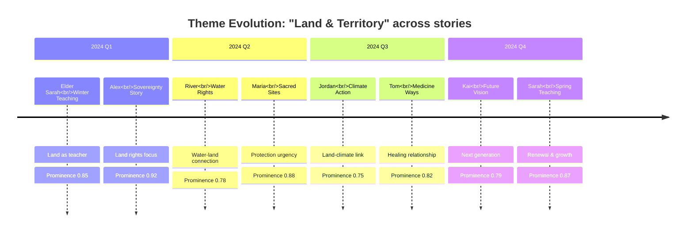

**Theme Trend:**
```
0.95 |                     ● Alex
0.90 |                    ╱│
0.85 | ● Sarah          ╱  │  ● Maria
0.80 |        ╲       ╱    │ ╱       ● Tom    ● Sarah
0.75 |         ╲    ╱      ●       ╱           │
0.70 |          ╲ ●              ╱             ● Kai
     └─────────────────────────────────────────────→
       Jan    Feb   Mar   Apr   May   Jun   Jul   Aug   Sep   Oct   Nov   Dec
```

---

## 🔍 Connection Discovery Algorithm

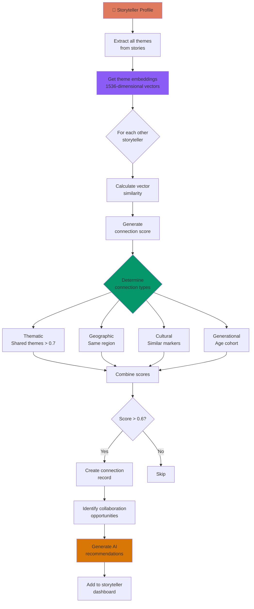

---

## 💾 Database Table Relationships (Simplified)

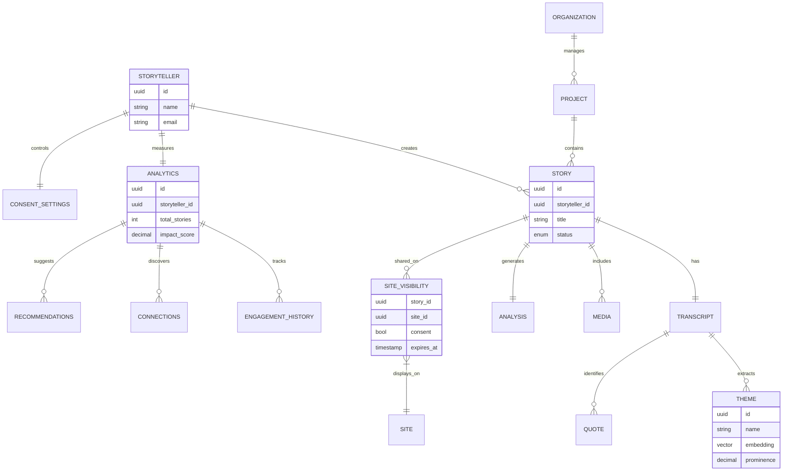

---

## 📈 Data Volume & Growth

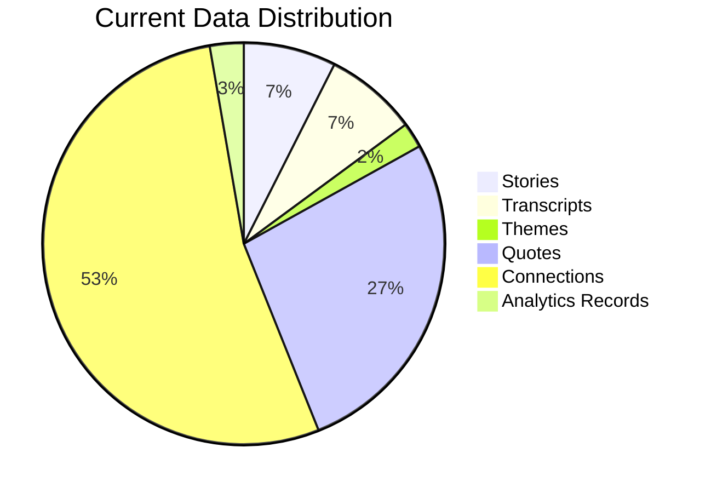

**Growth Projection:**
```
Stories Created per Month

1500 |                                    ●
1400 |                                 ●╱
1300 |                              ●╱
1200 |                           ●╱
1100 |                        ●╱
1000 |                     ●╱
 900 |                  ●╱
 800 |               ●╱
 700 |            ●╱
 600 |         ●╱
 500 |      ●╱
     └──────────────────────────────────────→
       Jan  Feb  Mar  Apr  May  Jun  Jul  Aug
```

---

## 🎯 Key Data Relationships Summary

### 1. **Storyteller → Stories** (1:many)
- One storyteller creates multiple stories
- Each story has exactly one storyteller
- Stories can be shared across multiple sites with consent

### 2. **Organization → Projects** (1:many)
- One org manages multiple projects
- Projects belong to one organization
- Projects can have multiple stories

### 3. **Story → Transcript → Analysis** (1:1:1)
- Each story has one transcript
- Each transcript generates one analysis record
- Analysis produces themes, quotes, insights

### 4. **Story → Themes** (many:many)
- Stories explore multiple themes
- Themes appear in multiple stories
- Prominence scores track relevance

### 5. **Storyteller → Analytics → Connections** (1:1:many)
- Each storyteller has one analytics record
- Analytics discovers multiple connections
- Connections link storytellers via themes, geography, etc.

### 6. **Story → Sites** (many:many via consent)
- Stories can appear on multiple sites
- Each visibility requires storyteller consent
- Consent can be revoked instantly

---

## 🔄 Data Lifecycle

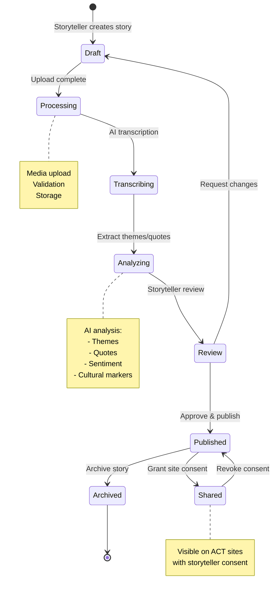

---

**Next:** Connect this to the **thematic network analysis** and show how AI discovers patterns across stories!
