# Impact Analysis System Architecture

Complete diagrams showing how all database tables, services, and visualizations connect.

---

## 📊 Database Tables Overview

### All 15 Impact Analysis Tables


---

## 🔄 Data Flow Architecture

### Complete System Flow

```mermaid
flowchart TB
    %% Input Sources
    Story[📖 Story Published]
    Audio[🎤 Audio Recording]
    Project[📁 Project Created]
    Community[👥 Community Participation]

    %% Processing Services
    NarrativeService[🧠 Narrative Analysis Service]
    VoiceService[🎵 Voice Analysis Service]
    SROIService[💰 SROI Calculator]

    %% Database Tables
    DB_Arcs[(Story Narrative Arcs)]
    DB_Audio_Prosody[(Audio Prosodic Analysis)]
    DB_Audio_Emotion[(Audio Emotion Analysis)]
    DB_Cultural[(Cultural Speech Patterns)]
    DB_Theme_Evo[(Theme Evolution)]
    DB_Theme_Concept[(Theme Concept Evolution)]
    DB_SROI_Input[(SROI Inputs)]
    DB_SROI_Outcome[(SROI Outcomes)]
    DB_SROI_Calc[(SROI Calculations)]
    DB_Ripple[(Ripple Effects)]
    DB_Harvested[(Harvested Outcomes)]
    DB_Interp[(Community Interpretations)]
    DB_Response[(Community Responses)]

    %% Visualization Components
    Viz_Arc[📊 Story Arc Visualization]
    Viz_SROI[💵 SROI Visualization]
    Viz_Ripple[🌊 Ripple Effect Visualization]
    Viz_Theme[📈 Theme Evolution Visualization]
    Viz_Dashboard[🎯 Impact Dashboard]

    %% Story Flow
    Story -->|Transcript| NarrativeService
    NarrativeService -->|Analyze sentiment| DB_Arcs
    DB_Arcs -->|Display| Viz_Arc

    Story -->|Themes tagged| DB_Theme_Evo
    DB_Theme_Evo -->|Track over time| Viz_Theme

    Story -->|Semantic analysis| DB_Theme_Concept
    DB_Theme_Concept -->|Show shifts| Viz_Theme

    %% Audio Flow
    Audio -->|Audio file| VoiceService
    VoiceService -->|Extract prosody| DB_Audio_Prosody
    VoiceService -->|Detect emotion| DB_Audio_Emotion
    VoiceService -->|Find patterns| DB_Cultural

    DB_Audio_Prosody -->|Show analysis| Viz_Dashboard
    DB_Audio_Emotion -->|Show analysis| Viz_Dashboard

    %% SROI Flow
    Project -->|Define investment| DB_SROI_Input
    DB_SROI_Input -->|Document outcomes| DB_SROI_Outcome
    DB_SROI_Outcome -->|Calculate| SROIService
    SROIService -->|Save results| DB_SROI_Calc
    DB_SROI_Calc -->|Visualize| Viz_SROI

    %% Community Flow
    Community -->|Report impact| DB_Ripple
    DB_Ripple -->|Chain effects| DB_Ripple
    DB_Ripple -->|Display| Viz_Ripple

    Community -->|Harvest outcomes| DB_Harvested
    Community -->|Interpret stories| DB_Interp
    Community -->|Respond to stories| DB_Response

    %% Dashboard Aggregation
    DB_Arcs --> Viz_Dashboard
    DB_Theme_Evo --> Viz_Dashboard
    DB_SROI_Calc --> Viz_Dashboard
    DB_Ripple --> Viz_Dashboard
    DB_Harvested --> Viz_Dashboard
    DB_Interp --> Viz_Dashboard

    %% Styling
    classDef inputClass fill:#D4936A,stroke:#BFA888,color:#fff
    classDef serviceClass fill:#8B5CF6,stroke:#7C3AED,color:#fff
    classDef dbClass fill:#3B82F6,stroke:#2563EB,color:#fff
    classDef vizClass fill:#10B981,stroke:#059669,color:#fff

    class Story,Audio,Project,Community inputClass
    class NarrativeService,VoiceService,SROIService serviceClass
    class DB_Arcs,DB_Audio_Prosody,DB_Audio_Emotion,DB_Cultural,DB_Theme_Evo,DB_Theme_Concept,DB_SROI_Input,DB_SROI_Outcome,DB_SROI_Calc,DB_Ripple,DB_Harvested,DB_Interp,DB_Response dbClass
    class Viz_Arc,Viz_SROI,Viz_Ripple,Viz_Theme,Viz_Dashboard vizClass
```



---

## 🎯 Component to Table Mapping

### Which Components Use Which Tables


---

## 📋 Complete Table Reference

### 1. Narrative Analysis Tables

#### **story_narrative_arcs**
**Purpose**: Track emotional journey through a story

**Key Fields**:
- `story_id` - Links to story
- `arc_type` - 'rags_to_riches', 'man_in_hole', 'cinderella', etc.
- `trajectory_data` - Array of {time, valence, arousal} points
- `emotional_range` - How much emotion varies
- `transformation_score` - Beginning vs end change
- `community_validated` - Community can override AI

**Used By**:
- ✅ StoryArcVisualization
- ✅ ImpactDashboard

**Populated By**:
- `analyzeStoryNarrativeArc()` service (OpenAI or lexicon)

---

#### **theme_evolution**
**Purpose**: Track theme prominence over time periods

**Key Fields**:
- `theme_id` - Links to theme
- `time_period_start/end` - Date range
- `story_count` - Stories in this period
- `prominence_score` - 0-1 how prominent
- `current_status` - 'emerging', 'growing', 'stable', 'declining', 'dormant', 'seasonal'

**Used By**:
- ✅ ThemeEvolutionVisualization
- ✅ ImpactDashboard

**Populated By**:
- Automatic tracking as stories are tagged with themes

---

#### **theme_concept_evolution**
**Purpose**: Track how theme meanings shift over time

**Key Fields**:
- `theme_id` - Links to theme
- `original_concept` - Initial meaning
- `evolved_concept` - New meaning
- `semantic_shift` - 0-1 how much it changed
- `evidence_quotes` - Supporting quotes
- `evolution_narrative` - Story of the change

**Used By**:
- ✅ ThemeEvolutionVisualization (semantic shift scatter plot)

**Populated By**:
- AI analysis comparing theme usage across time periods

---

### 2. Voice & Audio Analysis Tables

#### **audio_prosodic_analysis**
**Purpose**: Voice pitch, rhythm, intensity analysis (Praat)

**Key Fields**:
- `audio_id` - Links to media file
- `story_id` - Links to story
- `mean_pitch_hz` - Average pitch
- `pitch_range_semitones` - Pitch variation
- `speech_rate_sps` - Syllables per second
- `pause_count` - Number of pauses
- `jitter/shimmer` - Voice quality
- `hnr_db` - Harmonics-to-noise ratio

**Used By**:
- ✅ ImpactDashboard (voice analysis section)
- Future: ProsodyDashboard

**Populated By**:
- `analyzeAndSaveAudioProsody()` → calls Python `praat_analyzer.py`

---

#### **audio_emotion_analysis**
**Purpose**: Emotion detected from voice

**Key Fields**:
- `audio_id` - Links to media file
- `emotion_label` - 'joy', 'sadness', 'pride', etc.
- `arousal` - 0-1 energy level
- `valence` - -1 to 1 (negative to positive)
- `confidence` - How certain
- `temporal_segments` - Emotion timeline

**Used By**:
- ✅ ImpactDashboard
- Future: EmotionTimeline component

**Populated By**:
- `analyzeAndSaveAudioProsody()` - Maps prosody to emotion

---

#### **cultural_speech_patterns**
**Purpose**: Indigenous linguistic markers

**Key Fields**:
- `pattern_type` - 'code_switching', 'traditional_formula', 'ceremonial', etc.
- `time_start/end` - When in audio
- `description` - What was detected
- `cultural_context` - Significance
- `validated_by_community` - Community confirms

**Used By**:
- Future: Cultural Markers visualization

**Populated By**:
- AI/ML detection + community validation

---

### 3. SROI Tables

#### **sroi_inputs**
**Purpose**: Investment tracking for SROI

**Key Fields**:
- `project_id` / `organization_id` - Context
- `total_investment` - $$ invested
- `funding_sources` - Where money came from
- `period_start/end` - Time period
- `discount_rate` - For present value calc (default 3.5%)

**Used By**:
- ✅ SROIVisualization
- ✅ ImpactDashboard

**Populated By**:
- Manual input by organization/project manager

---

#### **sroi_outcomes**
**Purpose**: Outcomes achieved with financial proxies

**Key Fields**:
- `sroi_input_id` - Links to investment
- `outcome_type` - 'cultural_preservation', 'youth_wellbeing', etc.
- `stakeholder_group` - 'youth', 'elders', 'community', etc.
- `beneficiary_count` - How many people
- `financial_proxy` - $$ value per person
- `deadweight` - Would have happened anyway (0-1)
- `attribution` - Due to this project (0-1)
- `drop_off` - Decay rate per year (0-1)
- `duration_years` - How long benefit lasts

**Used By**:
- ✅ SROIVisualization
- ✅ ImpactDashboard

**Populated By**:
- `calculateSROI()` service with FINANCIAL_PROXIES library

---

#### **sroi_calculations**
**Purpose**: Calculated SROI results

**Key Fields**:
- `sroi_input_id` - Links to investment
- `total_social_value` - $$ value created
- `sroi_ratio` - Value per $1 invested
- `sensitivity_conservative/optimistic` - Confidence range

**Used By**:
- ✅ SROIVisualization (main ratio display)

**Populated By**:
- `calculateSROI()` service
- Database function `calculate_sroi_outcome_value()`

---

### 4. Ripple Effects & Outcomes Tables

#### **ripple_effects**
**Purpose**: Track impact spreading through 5 levels

**Key Fields**:
- `story_id` / `project_id` - Source
- `ripple_level` - 1-5 (storyteller → family → community → other communities → policy)
- `ripple_label` - Human-readable label
- `effect_description` - What happened
- `people_affected` - How many
- `time_lag_days` - How long after story
- `triggered_by` - Chain: which effect caused this
- `reported_by` - Community reporter

**Used By**:
- ✅ RippleEffectVisualization
- ✅ ImpactDashboard

**Populated By**:
- Community reporting form
- Manual documentation

---

#### **harvested_outcomes**
**Purpose**: Emergent, unexpected outcomes (Outcome Harvesting methodology)

**Key Fields**:
- `outcome_description` - What changed
- `change_type` - 'behavioral', 'relational', 'policy', etc.
- `significance_level` - 'transformative', 'significant', 'moderate', 'minor'
- `who_changed` - Which people/groups
- `what_changed` - Specific aspect
- `how_much_changed` - Quantification
- `contribution_narrative` - How project contributed
- `evidence_quotes` - Supporting evidence
- `is_unexpected` - Was this planned?

**Used By**:
- ✅ ParticipatoryEvaluation (HarvestedOutcomesList)

**Populated By**:
- OutcomeHarvestingForm (community input)

---

### 5. Participatory Evaluation Tables

#### **community_interpretation_sessions**
**Purpose**: Document collective meaning-making sessions

**Key Fields**:
- `story_id` / `theme_id` - What was interpreted
- `participant_count` - How many attended
- `interpretation_type` - 'thematic', 'narrative', 'emotional', etc.
- `key_interpretations` - What was understood
- `consensus_points` - Agreement
- `divergent_views` - Healthy disagreement
- `cultural_context` - Indigenous knowledge
- `recommendations` - What should happen next

**Used By**:
- ✅ ParticipatoryEvaluation (InterpretationSessionsList)

**Populated By**:
- InterpretationSessionForm

---

#### **storytelling_circle_evaluations**
**Purpose**: Evaluate storytelling circle effectiveness

**Key Fields**:
- `circle_date` - When held
- `participant_count` - Attendance
- `protocols_followed` - Cultural protocols
- `stories_shared` - How many
- `collective_insights` - Group learnings
- `emotional_tone` - Overall feeling
- `safety_rating` - 1-5 how safe people felt

**Used By**:
- Future: Circle Evaluation dashboard

**Populated By**:
- Facilitator documentation

---

#### **community_story_responses**
**Purpose**: Individual community responses to stories

**Key Fields**:
- `story_id` - Which story
- `response_type` - 'reflection', 'connection', 'action', etc.
- `emotional_reaction` - How it made them feel
- `personal_connection` - Why it resonated
- `action_inspired` - What they'll do
- `shared_with_others` - Did they share

**Used By**:
- Story impact pages
- ImpactDashboard

**Populated By**:
- Community response forms

---

### 6. Theory of Change Table

#### **theory_of_change**
**Purpose**: Define project's theory of change

**Key Fields**:
- `project_id` - Which project
- `inputs` - Resources (JSONB)
- `activities` - What you do (JSONB)
- `outputs` - Direct results (JSONB)
- `outcomes` - Changes (JSONB)
- `impact` - Long-term change (JSONB)
- `assumptions` - What must be true
- `external_factors` - Outside influences
- `indicators` - How to measure

**Used By**:
- Future: Theory of Change builder

**Populated By**:
- ToC planning interface

---

## 🔗 Table Relationships Summary

```
stories
├─→ story_narrative_arcs (1:1)
├─→ ripple_effects (1:many)
└─→ community_story_responses (1:many)

projects
├─→ ripple_effects (1:many)
├─→ harvested_outcomes (1:many)
├─→ theory_of_change (1:many)
└─→ storytelling_circle_evaluations (1:many)

organizations
└─→ sroi_inputs (1:many)

themes
├─→ theme_evolution (1:many)
├─→ theme_concept_evolution (1:many)
└─→ community_interpretation_sessions (1:many)

media_assets
├─→ audio_prosodic_analysis (1:1)
├─→ audio_emotion_analysis (1:1)
└─→ cultural_speech_patterns (1:many)

sroi_inputs
├─→ sroi_outcomes (1:many)
└─→ sroi_calculations (1:many)

ripple_effects
└─→ ripple_effects (self-reference for chains)

profiles
├─→ [validates] story_narrative_arcs
├─→ [reports] ripple_effects
├─→ [harvests] harvested_outcomes
├─→ [facilitates] community_interpretation_sessions
└─→ [responds] community_story_responses
```

---

## 📊 Data Volume Expectations

| Table | Expected Volume | Growth Rate |
|-------|----------------|-------------|
| story_narrative_arcs | 1 per analyzed story | Medium |
| theme_evolution | Monthly records per theme | Steady |
| theme_concept_evolution | Quarterly per theme | Low |
| audio_prosodic_analysis | 1 per audio story | Medium |
| audio_emotion_analysis | 1 per audio story | Medium |
| cultural_speech_patterns | 0-10 per audio story | Low |
| sroi_inputs | 1-4 per org/year | Low |
| sroi_outcomes | 5-20 per SROI input | Low |
| sroi_calculations | 1-3 per SROI input | Low |
| ripple_effects | 10-100 per project | High |
| harvested_outcomes | 5-30 per project | Medium |
| community_interpretation_sessions | 1-10 per month | Medium |
| storytelling_circle_evaluations | 1-4 per month | Low |
| community_story_responses | 5-50 per popular story | High |
| theory_of_change | 1 per project | Low |

---

This architecture supports the complete impact analysis lifecycle from data collection through visualization! 🎉
