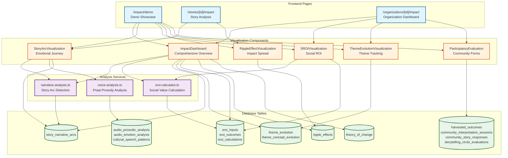
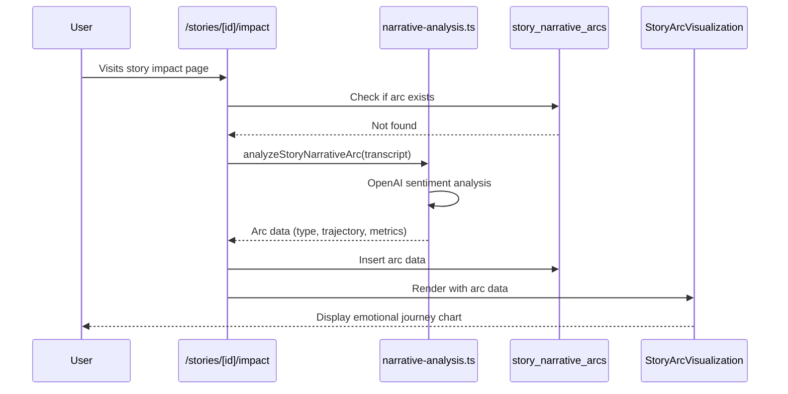
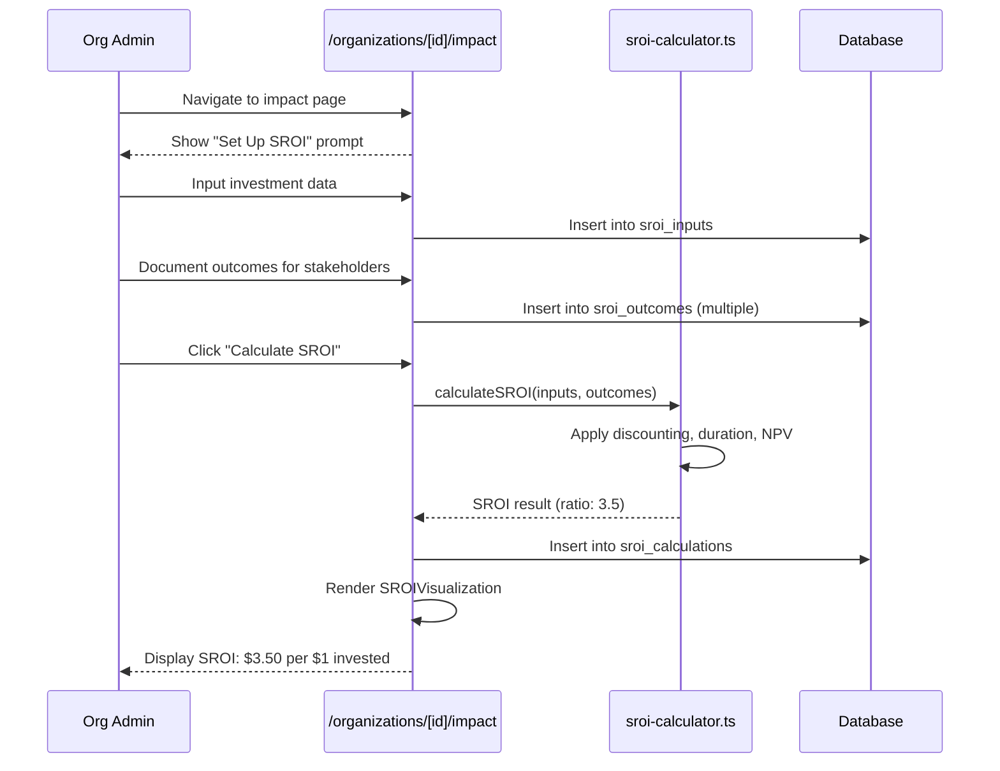
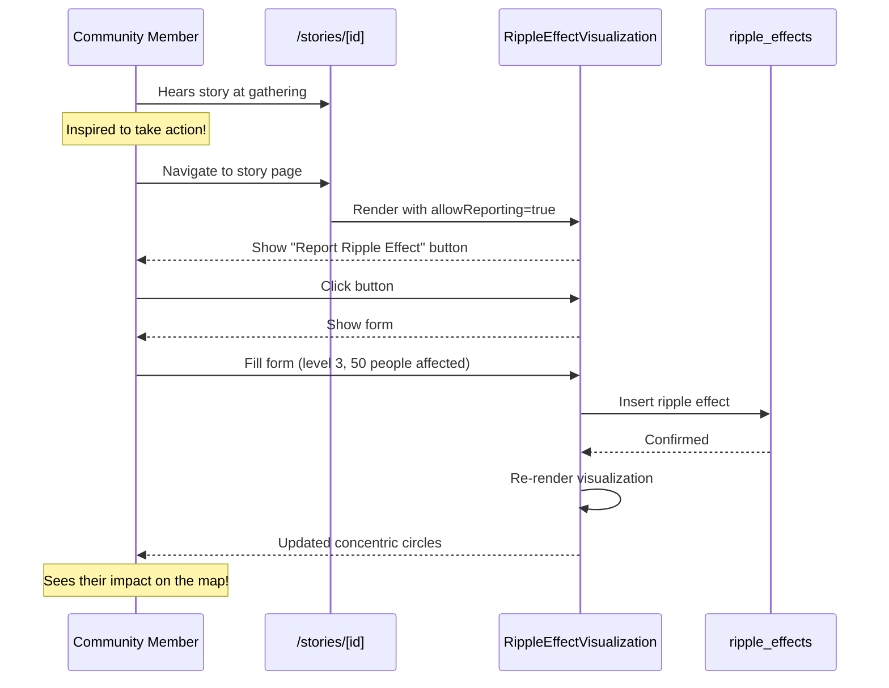
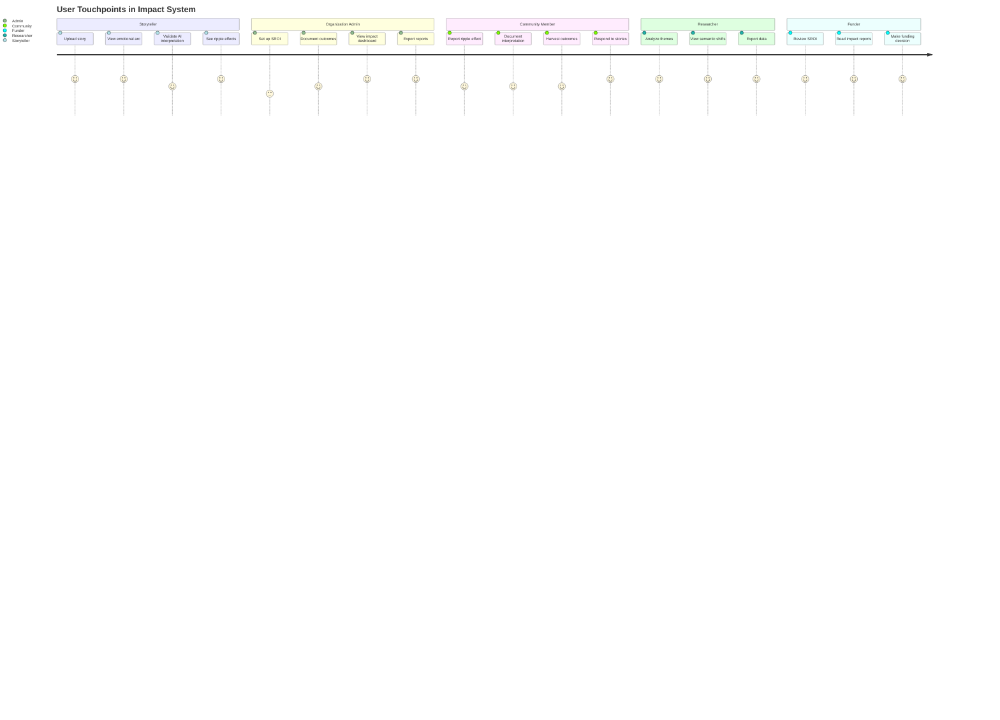
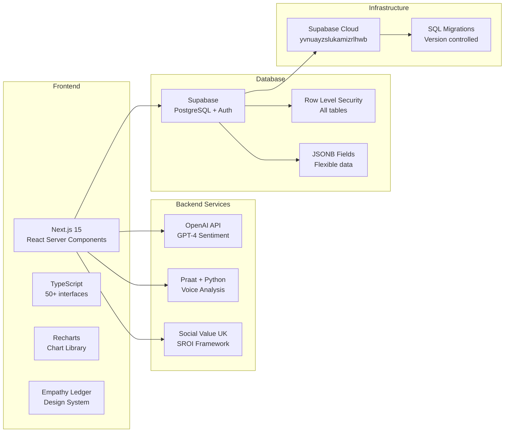
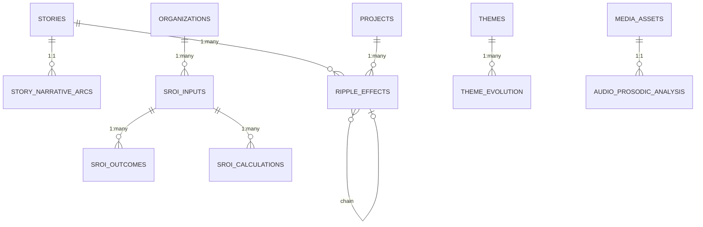

# Impact Analysis System Map

Complete visual reference showing how all components, services, database tables, and pages connect in the Empathy Ledger impact analysis system.

---

## 🗺️ Complete System Overview



---

## 📋 Quick Reference Tables

### Components → Database Tables

| Component | Primary Tables | Purpose |
|-----------|----------------|---------|
| **StoryArcVisualization** | `story_narrative_arcs` | Display emotional journey line chart |
| **SROIVisualization** | `sroi_inputs`, `sroi_outcomes`, `sroi_calculations` | Show social return on investment |
| **RippleEffectVisualization** | `ripple_effects` | Concentric circles showing impact spread |
| **ThemeEvolutionVisualization** | `theme_evolution`, `theme_concept_evolution` | Stacked area charts for theme tracking |
| **ImpactDashboard** | All tables | Comprehensive multi-tab overview |
| **ParticipatoryEvaluation** | `harvested_outcomes`, `community_interpretation_sessions`, `community_story_responses`, `storytelling_circle_evaluations` | Community forms and lists |

### Services → Database Tables

| Service | Input | Output Tables | Method |
|---------|-------|---------------|--------|
| **narrative-analysis.ts** | Story transcript | `story_narrative_arcs` | OpenAI GPT-4 sentiment analysis or lexicon-based |
| **sroi-calculator.ts** | Inputs + outcomes | `sroi_calculations` | Social Value UK framework calculations |
| **voice-analysis.ts** | Audio file (.wav) | `audio_prosodic_analysis`, `audio_emotion_analysis`, `cultural_speech_patterns` | Praat phonetics analysis (Python) |

### Pages → Components Used

| Page | Components | Purpose |
|------|------------|---------|
| **/impact/demo** | All 6 components | Full system showcase with examples |
| **/stories/[id]/impact** | StoryArcVisualization, RippleEffectVisualization | Individual story analysis |
| **/organizations/[id]/impact** | ImpactDashboard, SROIVisualization, ThemeEvolutionVisualization, ParticipatoryEvaluation | Organization-level impact tracking |

---

## 🔄 Data Flow Examples

### Example 1: Story Published → Emotional Arc Displayed



### Example 2: Organization Calculates SROI



### Example 3: Community Reports Ripple Effect



---

## 🎯 Integration Points

### Where Users Interact with Impact System



---

## 🏗️ Technology Stack



---

## 📊 Database Schema Summary

### 15 Tables Organized by Category

**1. Story Analysis (3 tables)**
- `story_narrative_arcs` - Emotional journey classification
- `community_story_responses` - Community feedback
- `ripple_effects` - Impact spreading (5 levels)

**2. Theme Analysis (2 tables)**
- `theme_evolution` - Theme prominence over time
- `theme_concept_evolution` - Semantic shift tracking

**3. Voice Analysis (3 tables)**
- `audio_prosodic_analysis` - Pitch, rhythm, intensity
- `audio_emotion_analysis` - Emotion from voice
- `cultural_speech_patterns` - Indigenous linguistic markers

**4. Social ROI (3 tables)**
- `sroi_inputs` - Investment data
- `sroi_outcomes` - Stakeholder outcomes
- `sroi_calculations` - SROI results

**5. Participatory Evaluation (4 tables)**
- `harvested_outcomes` - Emergent changes
- `community_interpretation_sessions` - Group interpretations
- `storytelling_circle_evaluations` - Circle protocols
- `theory_of_change` - ToC framework

---

## 🔑 Key Relationships



**Cardinality Explained:**
- **Story → Narrative Arc**: 1:1 (each story has one emotional journey)
- **Story → Ripple Effects**: 1:many (one story can create multiple ripples)
- **SROI Input → Outcomes**: 1:many (one analysis period has multiple outcomes)
- **Ripple Effect → Ripple Effect**: Self-referencing (ripples trigger other ripples)
- **Media Asset → Prosodic Analysis**: 1:1 (each audio file has one analysis)

---

## 🎨 Component Variants

### StoryArcVisualization
- `compact` - Small inline preview
- `default` - Standard card display
- `detailed` - Full metrics + description

### SROIVisualization
- `compact` - Just SROI ratio badge
- `summary` - Ratio + key metrics
- `full` - Complete analysis with charts

### RippleEffectVisualization
- `compact` - Simple list view
- `default` - Concentric circles
- `detailed` - Circles + timeline + stats

### ThemeEvolutionVisualization
- `timeline` - Linear timeline view
- `flow` - Sankey/flow diagram
- `semantic` - Semantic shift focus
- `full` - All views combined

### ImpactDashboard
Views by role:
- `storyteller` - Personal impact
- `organization` - Org-level metrics
- `platform` - Platform-wide analytics

---

## 📖 Documentation Index

| Document | Purpose | Key Content |
|----------|---------|-------------|
| [IMPACT_SYSTEM_ARCHITECTURE.md](./IMPACT_SYSTEM_ARCHITECTURE.md) | Technical architecture | ERD, data flow, table reference |
| [IMPACT_USER_JOURNEY.md](./IMPACT_USER_JOURNEY.md) | User flows | 6 journey maps, sequence diagrams |
| [IMPACT_SYSTEM_MAP.md](./IMPACT_SYSTEM_MAP.md) | System overview (this doc) | Complete system visualization |
| [IMPACT_ANALYSIS_README.md](./IMPACT_ANALYSIS_README.md) | Usage guide | How to use components and services |
| [IMPACT_INTEGRATION_GUIDE.md](./IMPACT_INTEGRATION_GUIDE.md) | Integration examples | Code examples for common patterns |
| [IMPACT_SYSTEM_SUMMARY.md](../IMPACT_SYSTEM_SUMMARY.md) | Executive summary | What was built, by the numbers |

---

## 🚀 Quick Start Guide

### 1. View the Demo
```bash
# Navigate to demo page
/impact/demo
```

### 2. Analyze a Story
```typescript
// In /stories/[id]/impact page
const arc = await analyzeStoryNarrativeArc(transcript, { method: 'openai' })
await supabase.from('story_narrative_arcs').insert({ story_id, ...arc })
```

### 3. Calculate SROI
```typescript
// In /organizations/[id]/impact page
const result = calculateSROI(inputs, outcomes)
// result.sroi_ratio: 3.5
```

### 4. Display Visualization
```typescript
import { StoryArcVisualization } from '@/components/impact/StoryArcVisualization'

<StoryArcVisualization
  arc={arcData}
  storyTitle="The Winter Teaching"
  variant="detailed"
/>
```

---

## 🔍 Finding Your Way

**Want to understand the database?**
→ See [IMPACT_SYSTEM_ARCHITECTURE.md](./IMPACT_SYSTEM_ARCHITECTURE.md) - Complete ERD + table reference

**Want to see how users interact?**
→ See [IMPACT_USER_JOURNEY.md](./IMPACT_USER_JOURNEY.md) - 6 user journey flows

**Want to integrate components?**
→ See [IMPACT_INTEGRATION_GUIDE.md](./IMPACT_INTEGRATION_GUIDE.md) - Code examples

**Want to understand methodologies?**
→ See [IMPACT_ANALYSIS_STRATEGY.md](./IMPACT_ANALYSIS_STRATEGY.md) - 13,000-line framework

**Want a quick lookup?**
→ See [VISUALIZATION_QUICK_REFERENCE.md](./VISUALIZATION_QUICK_REFERENCE.md) - Fast component reference

---

**Complete. Production Ready. Documented.** ✅

The Empathy Ledger impact analysis system is live and ready to demonstrate measurable social value!
