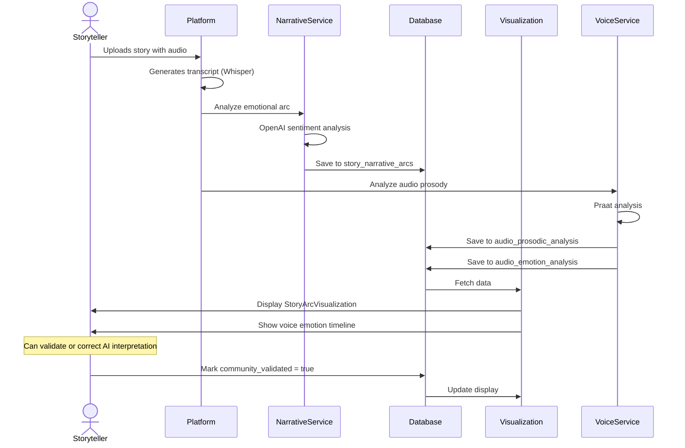
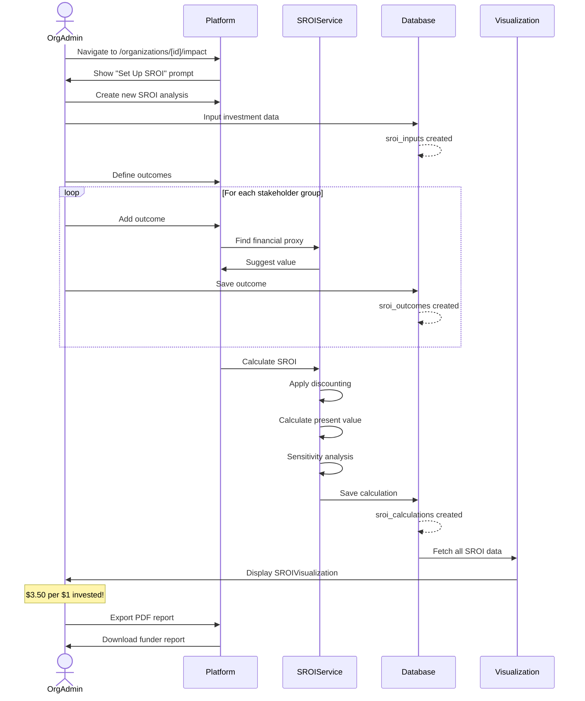
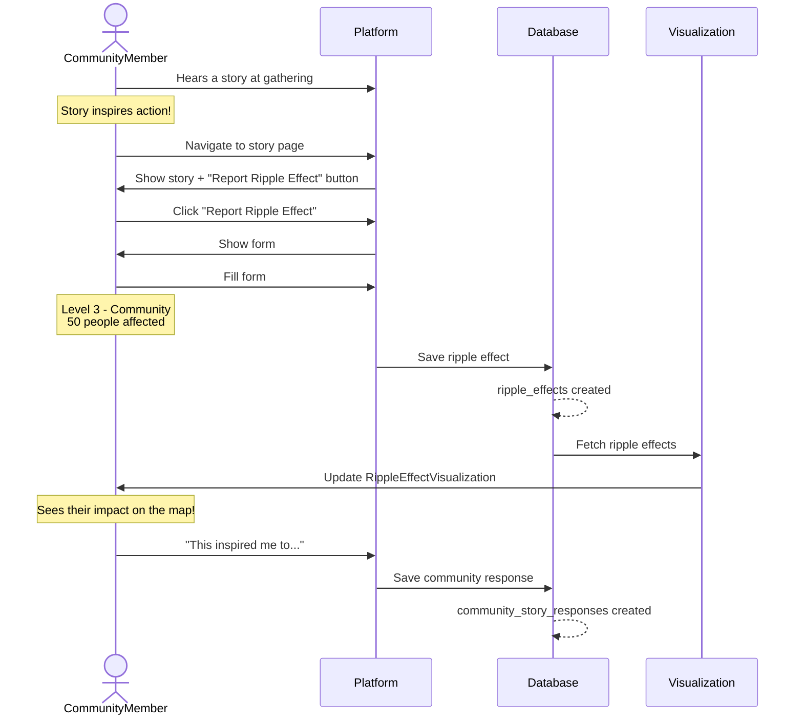
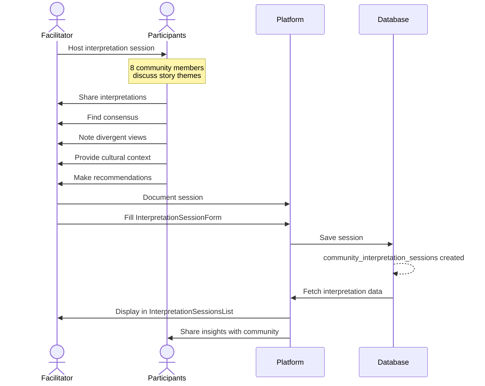
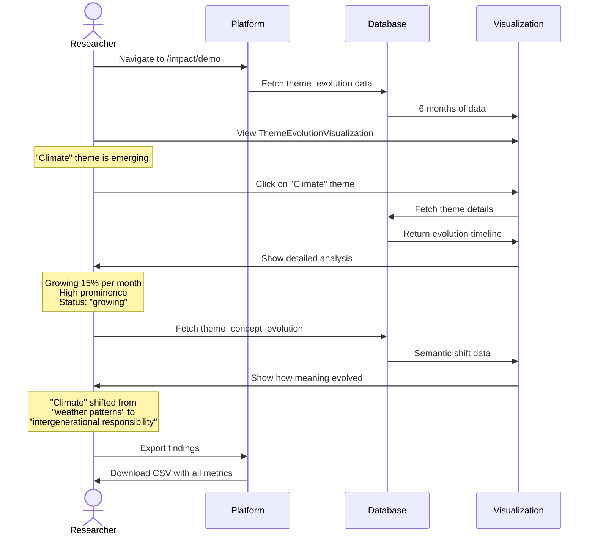
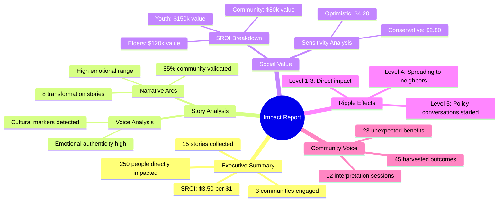
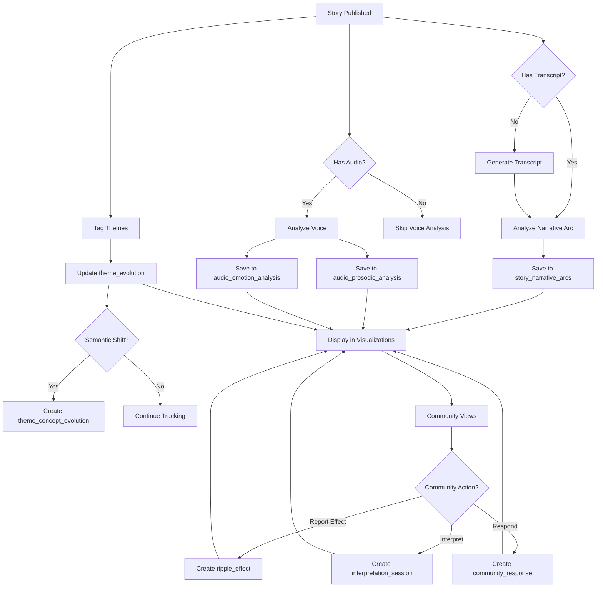

# Impact Analysis System - User Journeys

Real-world examples of how different users interact with the impact analysis system.

---

## 👤 User Roles

1. **Storyteller** - Shares stories and sees personal impact
2. **Organization Admin** - Tracks organizational impact and SROI
3. **Community Member** - Reports ripple effects and participates in evaluation
4. **Researcher** - Analyzes themes and patterns
5. **Funder** - Reviews SROI and impact reports

---

## 🌊 Journey 1: Storyteller Shares a Story

### Flow Diagram



### Step-by-Step Experience

1. **Storyteller uploads story**
   - Provides title, audio recording
   - Platform auto-generates transcript

2. **Automatic analysis runs**
   ```sql
   -- Story arc created
   INSERT INTO story_narrative_arcs (story_id, arc_type, trajectory_data, ...)
   VALUES ('story-123', 'man_in_hole', [...], ...)

   -- Voice analysis created
   INSERT INTO audio_prosodic_analysis (audio_id, mean_pitch_hz, speech_rate_sps, ...)
   INSERT INTO audio_emotion_analysis (audio_id, emotion_label, arousal, valence, ...)
   ```

3. **Storyteller views their impact**
   - Visits `/stories/story-123/impact`
   - Sees emotional journey visualization
   - Sees voice analysis (pitch, emotion, cultural markers)

4. **Community validation**
   - Reviews AI interpretation
   - Can override if needed
   - Adds cultural context

---

## 🏢 Journey 2: Organization Calculates SROI

### Flow Diagram



### Step-by-Step Experience

1. **Admin starts SROI**
   - Goes to organization impact page
   - Clicks "Set Up SROI Analysis"

2. **Defines investment**
   ```typescript
   const inputs = {
     total_investment: 100000,
     funding_sources: [
       { source: 'Foundation Grant', amount: 75000 },
       { source: 'Government', amount: 25000 }
     ],
     period_start: '2024-01-01',
     period_end: '2024-12-31',
     discount_rate: 0.035
   }
   ```

3. **Documents outcomes**
   ```typescript
   const outcomes = [
     {
       outcome_type: 'cultural_preservation',
       outcome_description: 'Youth develop stronger cultural connection',
       stakeholder_group: 'youth',
       beneficiary_count: 50,
       quantity: 50,
       financial_proxy: 500,  // Cultural camp value
       deadweight: 0.2,       // 20% would have happened anyway
       attribution: 0.8,      // 80% due to this project
       drop_off: 0.1,         // 10% decay per year
       duration_years: 3      // Benefits last 3 years
     },
     {
       outcome_type: 'elder_wellbeing',
       stakeholder_group: 'elders',
       beneficiary_count: 20,
       financial_proxy: 300,
       // ... other fields
     }
   ]
   ```

4. **Views results**
   ```
   SROI Calculation Results:

   Total Investment: $100,000
   Total Social Value: $350,000
   SROI Ratio: $3.50

   Sensitivity Analysis:
   - Conservative: $2.80
   - Base Case: $3.50
   - Optimistic: $4.20

   Value by Stakeholder:
   - Youth: $150,000 (43%)
   - Elders: $120,000 (34%)
   - Community: $80,000 (23%)
   ```

5. **Shares with funders**
   - Exports PDF report
   - Includes charts, findings, recommendations
   - Demonstrates measurable social value

---

## 🌱 Journey 3: Community Reports Ripple Effect

### Flow Diagram



### Step-by-Step Experience

1. **Hears story at community event**
   - Elder shares story about traditional fishing
   - Inspires youth to organize fishing trip

2. **Reports the ripple effect**
   ```typescript
   {
     story_id: 'story-456',
     ripple_level: 3,  // Community level
     ripple_label: 'community',
     effect_description: 'Story inspired 12 youth to organize traditional fishing trip with elders',
     people_affected: 50,  // Families who received fish
     geographic_scope: 'Local community',
     time_lag_days: 14,  // 2 weeks after hearing story
     evidence: 'Photos from fishing trip, testimonials from youth'
   }
   ```

3. **Effect appears in visualization**
   - Concentric circle diagram updates
   - Shows Level 3 (community) ring
   - Dot sized by 50 people affected

4. **This triggers another ripple**
   ```typescript
   {
     ripple_level: 4,  // Other communities
     effect_description: 'Neighboring community heard about trip, organizing their own',
     people_affected: 30,
     triggered_by: 'ripple-123',  // Chain from previous effect
     time_lag_days: 30
   }
   ```

5. **Community sees collective impact**
   - Timeline view shows effect chains
   - Statistics: 80 total people affected
   - Multiple communities engaged

---

## 👥 Journey 4: Community Interpretation Session

### Flow Diagram



### Step-by-Step Experience

1. **Facilitator plans session**
   - Invites 8 community members
   - Focuses on climate change stories
   - Follows cultural protocols

2. **Session happens**
   - Participants listen to 3 stories
   - Discuss themes and meanings
   - Share personal connections

3. **Facilitator documents results**
   ```typescript
   {
     story_id: 'story-789',
     session_date: '2024-12-20',
     participant_count: 8,
     interpretation_type: 'thematic',

     key_interpretations: [
       'Stories show deep connection between land health and community health',
       'Youth are ready to take action but need elder guidance',
       'Traditional practices offer solutions to modern problems'
     ],

     consensus_points: [
       'Need to document more elder knowledge about climate adaptation',
       'Youth want to learn traditional practices'
     ],

     divergent_views: [
       'Some felt focus should be on policy advocacy',
       'Others prioritized direct community action'
     ],

     cultural_context: 'Stories shared during winter moon, appropriate for planning discussions',

     recommendations: [
       'Organize inter-generational workshops',
       'Document traditional ecological knowledge',
       'Create youth-elder mentorship program'
     ]
   }
   ```

4. **Results inform action**
   - Organization sees recommendations
   - Adapts programming based on insights
   - Community feels heard and valued

---

## 📊 Journey 5: Researcher Analyzes Themes

### Flow Diagram



### Step-by-Step Experience

1. **Researcher accesses platform**
   - Views theme evolution dashboard
   - Sees 10 active themes tracked

2. **Identifies emerging pattern**
   ```sql
   SELECT
     theme_id,
     AVG(prominence_score) as avg_prominence,
     current_status,
     COUNT(*) as data_points
   FROM theme_evolution
   WHERE time_period_start >= '2024-06-01'
   GROUP BY theme_id, current_status
   ORDER BY avg_prominence DESC

   Results:
   - Climate Change: 0.85 prominence, "growing", 6 periods
   - Traditional Knowledge: 0.78 prominence, "stable", 6 periods
   - Youth Empowerment: 0.45 prominence, "emerging", 3 periods
   ```

3. **Analyzes semantic shift**
   ```sql
   SELECT *
   FROM theme_concept_evolution
   WHERE theme_id = 'climate'
   ORDER BY detected_at DESC

   Results show:
   - Original concept: "Changing weather patterns"
   - Evolved concept: "Intergenerational responsibility for land"
   - Semantic shift: 0.72 (significant change)
   - Evidence: 15 quotes showing shift
   ```

4. **Generates insights**
   - Climate is fastest-growing theme
   - Meaning has deepened over 6 months
   - Youth increasingly connecting climate to culture

5. **Shares findings**
   - Creates research report
   - Recommends climate-focused programming
   - Suggests policy advocacy opportunities

---

## 💼 Journey 6: Funder Reviews Impact Report

### What Funders See



### Funder Journey

1. **Receives quarterly report**
   - PDF generated from ImpactDashboard
   - Includes all visualizations
   - Executive summary on page 1

2. **Reviews SROI**
   - $3.50 per $1 invested
   - Compares to baseline ($2.00 expected)
   - Sees stakeholder breakdown

3. **Explores stories**
   - Reads 3 featured story arcs
   - Sees emotional journey charts
   - Watches video testimonials

4. **Validates with community data**
   - Sees community interpretation sessions
   - Reviews harvested outcomes
   - Reads direct quotes from participants

5. **Makes funding decision**
   - Evidence of impact: ✅
   - Community validation: ✅
   - Unexpected outcomes: ✅
   - **Approves renewal grant**

---

## 🔄 System Integration Points

### Where Users Interact with Impact System

| Page | User Type | What They Do | Tables Used |
|------|-----------|--------------|-------------|
| `/stories/[id]` | All | View story + impact tab | story_narrative_arcs, ripple_effects |
| `/stories/[id]/impact` | All | Deep dive on story impact | story_narrative_arcs, audio_prosodic_analysis, community_story_responses |
| `/organizations/[id]/impact` | Org Admin, Funders | Review org SROI & impact | sroi_*, ripple_effects, harvested_outcomes |
| `/impact/demo` | All | Learn about system | All tables (example data) |
| Story form | Community | Report ripple effects | ripple_effects |
| Evaluation form | Facilitator | Document interpretation | community_interpretation_sessions |
| Outcome form | Community | Harvest outcomes | harvested_outcomes |
| Admin dashboard | Platform Admin | Platform-wide analytics | All tables |

---

## 📈 Data Lifecycle

### How Data Flows Through the System



---

This shows how real users interact with every part of the impact analysis system! 🎯
