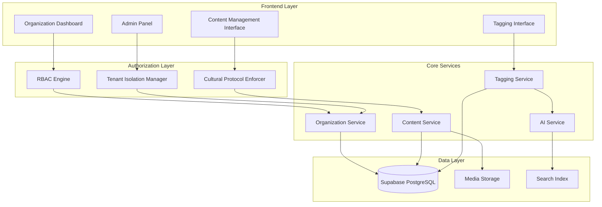

# Phase 2: Organizational Access & Tagging System - Design Document

**Version:** 1.0  
**Date:** September 13, 2025  
**Status:** DESIGN - Ready for Implementation  

---

## Executive Summary

Phase 2 introduces a world-class organizational access control and intelligent tagging system for the Empathy Ledger platform, specifically designed to respect indigenous governance structures and cultural protocols. This design builds upon the foundation established in Phase 1 and implements sophisticated multi-tenant content management with cultural sensitivity embedded at the architecture level.

### Key Design Decisions

1. **Indigenous-First RBAC**: Custom role-based access control system that prioritizes indigenous governance structures and elder authority
2. **Culturally-Aware AI Tagging**: AI-powered content tagging with cultural context validation and community-controlled vocabularies
3. **Multi-Tenant Content Isolation**: Advanced tenant isolation with cross-organizational collaboration capabilities
4. **OCAP® Principle Integration**: Complete implementation of ownership, control, access, and possession principles

### Implementation Timeline

- **Weeks 1-2**: Core RBAC and organizational access control
- **Weeks 3-4**: Intelligent tagging system with AI integration
- **Weeks 5-6**: Unified organizational dashboard and cross-tenant features
- **Weeks 7-8**: Testing, optimization, and cultural validation

---

## Overview

### Problem Statement

Current organizational pages lack sophisticated access control and intelligent content management. The platform needs a world-class system that:
- Respects indigenous governance hierarchies
- Provides intelligent content tagging with cultural awareness
- Enables sophisticated multi-tenant content management
- Supports cross-organizational collaboration while maintaining sovereignty

### Design Philosophy

This design follows three core principles:
1. **Indigenous Governance First**: Technology adapts to cultural structures, not the reverse
2. **Cultural Sensitivity by Design**: Every feature considers cultural implications
3. **Community Control**: Organizations maintain complete control over their data and processes

---

## Architecture

### System Overview



### Multi-Tenant Architecture Design

The system implements a sophisticated shared database multi-tenant architecture with Row-Level Security (RLS) policies enforcing strict tenant isolation:

```sql
-- Enhanced Organizations Table
CREATE TABLE organizations (
  id UUID PRIMARY KEY DEFAULT gen_random_uuid(),
  name TEXT NOT NULL,
  slug TEXT UNIQUE NOT NULL,
  
  -- Cultural Identity
  cultural_identity JSONB NOT NULL DEFAULT '{}',
  governance_structure JSONB NOT NULL DEFAULT '{}',
  cultural_protocols JSONB NOT NULL DEFAULT '{}',
  
  -- Access Control
  default_permissions JSONB NOT NULL DEFAULT '{}',
  elder_oversight_required BOOLEAN DEFAULT false,
  community_approval_required BOOLEAN DEFAULT false,
  
  -- Cross-Organizational
  collaboration_settings JSONB NOT NULL DEFAULT '{}',
  shared_vocabularies TEXT[] DEFAULT ARRAY[]::TEXT[],
  
  -- Metadata
  created_at TIMESTAMPTZ DEFAULT NOW(),
  updated_at TIMESTAMPTZ DEFAULT NOW(),
  status organization_status DEFAULT 'active'
);

-- Enhanced Role Definitions
CREATE TYPE organization_role AS ENUM (
  'elder', 
  'cultural_keeper', 
  'admin', 
  'project_leader', 
  'storyteller', 
  'community_member', 
  'guest'
);

-- Cultural Permission Levels
CREATE TYPE cultural_permission_level AS ENUM (
  'sacred', 
  'restricted', 
  'community_only', 
  'public', 
  'educational'
);
```

### Cross-Organizational Data Model

```sql
-- Cross-Organizational Collaborations
CREATE TABLE organization_collaborations (
  id UUID PRIMARY KEY DEFAULT gen_random_uuid(),
  primary_organization_id UUID REFERENCES organizations(id),
  secondary_organization_id UUID REFERENCES organizations(id),
  collaboration_type collaboration_type NOT NULL,
  permissions JSONB NOT NULL DEFAULT '{}',
  cultural_agreements JSONB NOT NULL DEFAULT '{}',
  status collaboration_status DEFAULT 'proposed',
  created_at TIMESTAMPTZ DEFAULT NOW(),
  approved_by_primary UUID REFERENCES profiles(id),
  approved_by_secondary UUID REFERENCES profiles(id)
);

CREATE TYPE collaboration_type AS ENUM (
  'shared_project', 
  'knowledge_exchange', 
  'ceremonial_partnership', 
  'educational_alliance',
  'cultural_preservation'
);
```

---

## Components and Interfaces

### 1. Indigenous-Aware Role-Based Access Control (RBAC)

#### Core RBAC Engine

```typescript
// Core RBAC Types
interface OrganizationRole {
  id: string;
  name: string;
  type: 'elder' | 'cultural_keeper' | 'admin' | 'project_leader' | 
        'storyteller' | 'community_member' | 'guest';
  permissions: Permission[];
  culturalAuthority: CulturalAuthority;
  hierarchyLevel: number; // 1 (highest) to 10 (lowest)
  canDelegate: boolean;
  elderApprovalRequired: boolean;
}

interface CulturalAuthority {
  canReviewSacredContent: boolean;
  canApproveCulturalTags: boolean;
  canManageCeremonialContent: boolean;
  canAuthorizeExternalSharing: boolean;
  culturalDomains: string[]; // specific areas of cultural knowledge
}

interface Permission {
  id: string;
  action: string; // create, read, update, delete, approve, review
  resource: string; // stories, media, tags, projects, members
  scope: 'own' | 'project' | 'organization' | 'cross_org';
  conditions?: PermissionCondition[];
}

interface PermissionCondition {
  type: 'cultural_sensitivity' | 'elder_review' | 'time_restriction';
  value: any;
  operator: 'equals' | 'greater_than' | 'contains';
}
```

#### Cultural Protocol Enforcement

```typescript
class CulturalProtocolEnforcer {
  async checkCulturalAccess(
    user: User, 
    content: Content, 
    action: string
  ): Promise<AccessResult> {
    // Check cultural sensitivity level
    if (content.culturalSensitivityLevel === 'sacred') {
      const hasElder = await this.userHasElderStatus(user, content.organizationId);
      const hasCulturalDomain = await this.checkCulturalDomain(
        user, 
        content.culturalDomains
      );
      
      if (!hasElder || !hasCulturalDomain) {
        return {
          allowed: false,
          reason: 'Sacred content requires elder with appropriate cultural authority'
        };
      }
    }

    // Check elder approval requirements
    if (content.requiresElderApproval && action === 'publish') {
      const approval = await this.getElderApproval(content.id);
      if (!approval || !approval.approved) {
        return {
          allowed: false,
          reason: 'Content requires elder approval before publication',
          requiresApproval: true
        };
      }
    }

    return { allowed: true };
  }

  async enforceTraditionalHierarchy(
    user: User, 
    targetUser: User, 
    action: string
  ): Promise<boolean> {
    const userRole = await this.getUserRole(user);
    const targetRole = await this.getUserRole(targetUser);
    
    // Elders have authority over all other roles
    if (userRole.type === 'elder') return true;
    
    // Cultural keepers have authority over non-cultural roles
    if (userRole.type === 'cultural_keeper' && 
        !['elder', 'cultural_keeper'].includes(targetRole.type)) {
      return true;
    }
    
    // Hierarchy level comparison
    return userRole.hierarchyLevel < targetRole.hierarchyLevel;
  }
}
```

### 2. Intelligent Tagging System

#### AI-Powered Cultural Tagging Engine

```typescript
interface CulturalTag {
  id: string;
  name: string;
  category: TagCategory;
  culturalSensitivity: 'sacred' | 'restricted' | 'community' | 'public';
  description: string;
  culturalContext: string;
  approvedBy: string[]; // Elder IDs who approved this tag
  organizationId: string;
  isSharedAcrossOrgs: boolean;
  tradKnowledgeClassification: string;
  aiConfidence?: number;
  humanVerified: boolean;
}

type TagCategory = 
  | 'traditional_knowledge' 
  | 'ceremonial' 
  | 'ecological_knowledge'
  | 'language_preservation' 
  | 'cultural_practice' 
  | 'historical_event'
  | 'geographical_place' 
  | 'family_clan' 
  | 'seasonal_activity'
  | 'medicinal_knowledge';

class CulturallyAwareTaggingService {
  async generateTags(
    content: Content, 
    organizationId: string
  ): Promise<SuggestedTag[]> {
    // Get organization's cultural context and vocabulary
    const orgContext = await this.getOrganizationalCulturalContext(organizationId);
    const approvedVocabulary = await this.getApprovedTagVocabulary(organizationId);
    
    // AI-powered initial tagging with cultural context
    const aiSuggestions = await this.aiTaggingEngine.generateTags(content, {
      culturalContext: orgContext,
      vocabulary: approvedVocabulary,
      sensitivityGuidelines: orgContext.sensitivityGuidelines
    });
    
    // Filter and classify suggestions
    const suggestions = await Promise.all(
      aiSuggestions.map(async (tag) => {
        const culturalValidation = await this.validateCulturalAppropriateness(
          tag, 
          orgContext
        );
        
        return {
          ...tag,
          culturalValidation,
          requiresElderReview: this.requiresElderReview(tag, orgContext),
          suggestedSensitivity: this.suggestSensitivityLevel(tag, orgContext)
        };
      })
    );
    
    return suggestions;
  }

  async validateCulturalAppropriateness(
    tag: TagSuggestion, 
    context: CulturalContext
  ): Promise<ValidationResult> {
    // Check against cultural protocols
    const protocolViolations = await this.checkCulturalProtocols(tag, context);
    
    // Check traditional knowledge classification
    const tkClassification = await this.classifyTraditionalKnowledge(tag, context);
    
    // Check for potential sacred/restricted content
    const sensitivityCheck = await this.checkSensitivityLevel(tag, context);
    
    return {
      isValid: protocolViolations.length === 0,
      violations: protocolViolations,
      tkClassification,
      recommendedSensitivity: sensitivityCheck.level,
      confidence: sensitivityCheck.confidence
    };
  }
}
```

#### Community-Controlled Tag Vocabularies

```typescript
interface TagVocabulary {
  id: string;
  organizationId: string;
  name: string;
  description: string;
  category: TagCategory;
  terms: TagTerm[];
  isShared: boolean;
  sharedWithOrganizations: string[];
  elderApproved: boolean;
  approvedBy: string;
  approvedAt: Date;
  culturalSignificance: string;
}

interface TagTerm {
  term: string;
  description: string;
  culturalContext: string;
  sensitivity: 'sacred' | 'restricted' | 'community' | 'public';
  alternativeTerms: string[];
  relatedConcepts: string[];
  traditionalSpelling?: string;
  audioPronounciation?: string;
}

class CommunityVocabularyManager {
  async createOrganizationalVocabulary(
    organizationId: string,
    vocabulary: CreateVocabularyRequest,
    createdBy: string
  ): Promise<TagVocabulary> {
    // Validate creator has cultural authority
    const hasAuthority = await this.checkCulturalAuthority(
      createdBy, 
      'manage_vocabulary'
    );
    
    if (!hasAuthority) {
      throw new Error('Insufficient cultural authority to create vocabulary');
    }

    // Create vocabulary with elder approval workflow
    const vocab = await this.vocabularyRepository.create({
      ...vocabulary,
      organizationId,
      createdBy,
      status: 'pending_elder_review',
      requiresElderApproval: this.requiresElderApproval(vocabulary)
    });

    // Trigger elder review if required
    if (vocab.requiresElderApproval) {
      await this.initiateElderReview(vocab.id);
    }

    return vocab;
  }

  async shareVocabularyAcrossOrganizations(
    vocabularyId: string,
    targetOrganizations: string[],
    requestedBy: string
  ): Promise<SharingResult> {
    // Verify requester authority
    const hasAuthority = await this.checkCulturalAuthority(
      requestedBy, 
      'share_vocabulary'
    );

    // Check cultural protocols for vocabulary sharing
    const protocolChecks = await Promise.all(
      targetOrganizations.map(orgId => 
        this.checkSharingProtocols(vocabularyId, orgId)
      )
    );

    // Request approval from target organization elders
    const approvalRequests = await Promise.all(
      targetOrganizations.map(orgId =>
        this.requestVocabularyAcceptance(vocabularyId, orgId)
      )
    );

    return {
      requestId: generate_uuid(),
      pendingApprovals: approvalRequests,
      protocolCompliance: protocolChecks
    };
  }
}
```

### 3. Unified Organizational Dashboard

#### Dashboard Architecture

```typescript
interface OrganizationalDashboard {
  organizationId: string;
  userRole: OrganizationRole;
  sections: DashboardSection[];
  culturalContext: CulturalContext;
  permissions: UserPermissions;
}

interface DashboardSection {
  id: string;
  title: string;
  component: string;
  requiredRole?: string[];
  culturalPermission?: string;
  data: any;
  isCustomizable: boolean;
}

class DashboardPersonalizationService {
  async getPersonalizedDashboard(
    userId: string, 
    organizationId: string
  ): Promise<OrganizationalDashboard> {
    const user = await this.userService.getUser(userId);
    const userRole = await this.rbacService.getUserRole(userId, organizationId);
    const organization = await this.organizationService.getOrganization(organizationId);
    
    // Get role-appropriate sections
    const availableSections = await this.getDashboardSections(userRole, organization);
    
    // Apply cultural filtering
    const culturallyFilteredSections = await this.applyCulturalFiltering(
      availableSections, 
      user, 
      organization
    );
    
    // Personalize based on user preferences and cultural context
    const personalizedSections = await this.personalizeContent(
      culturallyFilteredSections, 
      user, 
      organization
    );
    
    return {
      organizationId,
      userRole,
      sections: personalizedSections,
      culturalContext: organization.culturalContext,
      permissions: await this.rbacService.getUserPermissions(userId, organizationId)
    };
  }

  private async applyCulturalFiltering(
    sections: DashboardSection[],
    user: User,
    organization: Organization
  ): Promise<DashboardSection[]> {
    return Promise.all(
      sections.map(async (section) => {
        // Filter content based on cultural permissions
        if (section.culturalPermission) {
          const hasPermission = await this.culturalProtocolEnforcer.checkCulturalAccess(
            user, 
            { culturalSensitivityLevel: section.culturalPermission },
            'read'
          );
          
          if (!hasPermission.allowed) {
            return null;
          }
        }
        
        // Apply data filtering based on cultural protocols
        const filteredData = await this.filterDataByCulturalProtocols(
          section.data, 
          user, 
          organization
        );
        
        return {
          ...section,
          data: filteredData
        };
      })
    ).then(sections => sections.filter(Boolean));
  }
}
```

#### Multi-Tenant Content Management

```typescript
interface ContentManagementInterface {
  organizationId: string;
  content: {
    stories: ContentCollection<Story>;
    media: ContentCollection<MediaAsset>;
    transcripts: ContentCollection<Transcript>;
    galleries: ContentCollection<Gallery>;
  };
  collaborations: CrossOrgCollaboration[];
  workflows: ContentWorkflow[];
}

interface ContentCollection<T> {
  items: T[];
  filters: ContentFilter[];
  permissions: ContentPermission[];
  culturalMetadata: CulturalMetadata;
  pagination: PaginationInfo;
}

class MultiTenantContentManager {
  async getOrganizationalContent(
    organizationId: string, 
    userId: string,
    filters?: ContentFilter[]
  ): Promise<ContentManagementInterface> {
    // Verify user access to organization
    const access = await this.rbacService.checkOrganizationAccess(
      userId, 
      organizationId
    );
    
    if (!access.allowed) {
      throw new UnauthorizedError('Access denied to organization content');
    }

    // Get content with cultural filtering
    const stories = await this.getFilteredContent('stories', {
      organizationId,
      userId,
      filters,
      culturalFiltering: true
    });

    const media = await this.getFilteredContent('media', {
      organizationId,
      userId,
      filters,
      culturalFiltering: true
    });

    // Get cross-organizational collaborations
    const collaborations = await this.getActiveCollaborations(
      organizationId, 
      userId
    );

    return {
      organizationId,
      content: {
        stories,
        media,
        transcripts: await this.getFilteredContent('transcripts', {
          organizationId, userId, filters, culturalFiltering: true
        }),
        galleries: await this.getFilteredContent('galleries', {
          organizationId, userId, filters, culturalFiltering: true
        })
      },
      collaborations,
      workflows: await this.getActiveWorkflows(organizationId, userId)
    };
  }

  async getFilteredContent<T>(
    contentType: string,
    options: ContentFilterOptions
  ): Promise<ContentCollection<T>> {
    // Apply tenant isolation
    const tenantFilter = this.buildTenantFilter(options.organizationId);
    
    // Apply role-based filtering
    const roleFilter = await this.buildRoleFilter(options.userId, options.organizationId);
    
    // Apply cultural sensitivity filtering
    const culturalFilter = await this.buildCulturalFilter(
      options.userId, 
      options.organizationId
    );
    
    // Combine all filters
    const combinedFilters = [
      ...tenantFilter,
      ...roleFilter,
      ...culturalFilter,
      ...(options.filters || [])
    ];
    
    // Execute filtered query
    const result = await this.contentRepository.findWithFilters(
      contentType,
      combinedFilters,
      {
        includeCulturalMetadata: true,
        respectCulturalProtocols: true
      }
    );
    
    return {
      items: result.items,
      filters: combinedFilters,
      permissions: await this.getContentPermissions(
        options.userId, 
        options.organizationId, 
        contentType
      ),
      culturalMetadata: result.culturalMetadata,
      pagination: result.pagination
    };
  }
}
```

---

## Data Models

### Enhanced Organization Schema

```sql
-- Organizations with cultural governance
CREATE TABLE organizations (
  id UUID PRIMARY KEY DEFAULT gen_random_uuid(),
  name TEXT NOT NULL,
  slug TEXT UNIQUE NOT NULL,
  description TEXT,
  
  -- Cultural Identity
  cultural_identity JSONB NOT NULL DEFAULT '{}',
  governance_structure JSONB NOT NULL DEFAULT '{}', 
  traditional_protocols JSONB NOT NULL DEFAULT '{}',
  cultural_domains TEXT[] DEFAULT ARRAY[]::TEXT[],
  
  -- Access Control Settings
  default_story_permission cultural_permission_level DEFAULT 'community_only',
  default_media_permission cultural_permission_level DEFAULT 'community_only',
  elder_oversight_required BOOLEAN DEFAULT true,
  community_approval_threshold INTEGER DEFAULT 1,
  
  -- Cross-Org Settings  
  allows_collaborations BOOLEAN DEFAULT true,
  shared_vocabulary_policy sharing_policy DEFAULT 'elder_approved',
  cross_org_visibility visibility_level DEFAULT 'limited',
  
  -- Contact and Admin
  primary_elder_contact UUID REFERENCES profiles(id),
  admin_contacts UUID[] DEFAULT ARRAY[]::UUID[],
  cultural_liaisons UUID[] DEFAULT ARRAY[]::UUID[],
  
  -- Metadata
  created_at TIMESTAMPTZ DEFAULT NOW(),
  updated_at TIMESTAMPTZ DEFAULT NOW(),
  status organization_status DEFAULT 'active'
);

-- Enhanced Role System
CREATE TABLE organization_roles (
  id UUID PRIMARY KEY DEFAULT gen_random_uuid(),
  organization_id UUID REFERENCES organizations(id) ON DELETE CASCADE,
  profile_id UUID REFERENCES profiles(id) ON DELETE CASCADE,
  
  -- Role Definition
  role_type organization_role NOT NULL,
  custom_role_name TEXT,
  hierarchy_level INTEGER NOT NULL DEFAULT 5, -- 1 highest, 10 lowest
  
  -- Cultural Authority
  cultural_domains TEXT[] DEFAULT ARRAY[]::TEXT[],
  can_review_sacred BOOLEAN DEFAULT false,
  can_approve_tags BOOLEAN DEFAULT false,
  can_manage_protocols BOOLEAN DEFAULT false,
  can_authorize_external_sharing BOOLEAN DEFAULT false,
  
  -- Permissions
  permissions JSONB NOT NULL DEFAULT '{}',
  delegation_authority INTEGER DEFAULT 0, -- levels they can delegate down
  
  -- Status and Approval
  status role_status DEFAULT 'active',
  approved_by UUID REFERENCES profiles(id),
  approved_at TIMESTAMPTZ,
  
  -- Metadata
  assigned_at TIMESTAMPTZ DEFAULT NOW(),
  expires_at TIMESTAMPTZ,
  created_by UUID REFERENCES profiles(id),
  
  UNIQUE(organization_id, profile_id)
);

-- Cultural Tag System
CREATE TABLE cultural_tags (
  id UUID PRIMARY KEY DEFAULT gen_random_uuid(),
  name TEXT NOT NULL,
  slug TEXT NOT NULL,
  
  -- Organization and Sharing
  organization_id UUID REFERENCES organizations(id),
  is_shared BOOLEAN DEFAULT false,
  shared_with_organizations UUID[] DEFAULT ARRAY[]::UUID[],
  
  -- Classification
  category tag_category NOT NULL,
  subcategory TEXT,
  cultural_sensitivity cultural_permission_level NOT NULL,
  traditional_knowledge_type TEXT,
  
  -- Content
  description TEXT NOT NULL,
  cultural_context TEXT,
  usage_guidelines TEXT,
  pronunciation_guide TEXT,
  alternative_spellings TEXT[],
  
  -- Approval and Governance
  elder_approved BOOLEAN DEFAULT false,
  approved_by UUID REFERENCES profiles(id),
  approved_at TIMESTAMPTZ,
  requires_elder_approval BOOLEAN DEFAULT true,
  
  -- AI and Validation
  ai_generated BOOLEAN DEFAULT false,
  ai_confidence NUMERIC(3,2),
  human_validated BOOLEAN DEFAULT false,
  validation_notes TEXT,
  
  -- Usage Tracking
  usage_count INTEGER DEFAULT 0,
  last_used_at TIMESTAMPTZ,
  
  -- Metadata
  created_at TIMESTAMPTZ DEFAULT NOW(),
  created_by UUID REFERENCES profiles(id),
  updated_at TIMESTAMPTZ DEFAULT NOW(),
  
  UNIQUE(organization_id, slug)
);

-- Content Tagging Relationships
CREATE TABLE content_tags (
  id UUID PRIMARY KEY DEFAULT gen_random_uuid(),
  content_id UUID NOT NULL,
  content_type content_type NOT NULL,
  tag_id UUID REFERENCES cultural_tags(id) ON DELETE CASCADE,
  
  -- Tagging Metadata
  tagged_by UUID REFERENCES profiles(id),
  tagged_at TIMESTAMPTZ DEFAULT NOW(),
  confidence NUMERIC(3,2), -- AI confidence if applicable
  source tag_source DEFAULT 'manual',
  
  -- Approval Workflow
  status tag_status DEFAULT 'active',
  elder_reviewed BOOLEAN DEFAULT false,
  reviewed_by UUID REFERENCES profiles(id),
  reviewed_at TIMESTAMPTZ,
  review_notes TEXT,
  
  UNIQUE(content_id, content_type, tag_id)
);

-- Cross-Organizational Collaborations
CREATE TABLE organization_collaborations (
  id UUID PRIMARY KEY DEFAULT gen_random_uuid(),
  
  -- Organizations
  primary_org_id UUID REFERENCES organizations(id),
  secondary_org_id UUID REFERENCES organizations(id),
  
  -- Collaboration Details
  collaboration_type collaboration_type NOT NULL,
  title TEXT NOT NULL,
  description TEXT,
  
  -- Permissions and Protocols
  shared_permissions JSONB NOT NULL DEFAULT '{}',
  cultural_agreements JSONB NOT NULL DEFAULT '{}',
  data_sharing_rules JSONB NOT NULL DEFAULT '{}',
  
  -- Status and Approval
  status collaboration_status DEFAULT 'proposed',
  primary_approved_by UUID REFERENCES profiles(id),
  primary_approved_at TIMESTAMPTZ,
  secondary_approved_by UUID REFERENCES profiles(id), 
  secondary_approved_at TIMESTAMPTZ,
  
  -- Lifecycle
  start_date DATE,
  end_date DATE,
  renewal_terms TEXT,
  
  -- Metadata
  created_at TIMESTAMPTZ DEFAULT NOW(),
  created_by UUID REFERENCES profiles(id),
  updated_at TIMESTAMPTZ DEFAULT NOW()
);

-- Vocabulary Sharing
CREATE TABLE shared_vocabularies (
  id UUID PRIMARY KEY DEFAULT gen_random_uuid(),
  
  -- Vocabulary Definition
  name TEXT NOT NULL,
  description TEXT,
  category tag_category NOT NULL,
  
  -- Ownership
  owner_organization_id UUID REFERENCES organizations(id),
  shared_with_organizations UUID[] DEFAULT ARRAY[]::UUID[],
  
  -- Tags in this vocabulary
  tag_ids UUID[] DEFAULT ARRAY[]::UUID[],
  
  -- Governance
  sharing_policy sharing_policy DEFAULT 'elder_approved',
  elder_approved BOOLEAN DEFAULT false,
  approved_by UUID REFERENCES profiles(id),
  
  -- Metadata
  created_at TIMESTAMPTZ DEFAULT NOW(),
  created_by UUID REFERENCES profiles(id),
  updated_at TIMESTAMPTZ DEFAULT NOW()
);
```

### Enums and Custom Types

```sql
-- Organization and Role Types
CREATE TYPE organization_role AS ENUM (
  'elder',
  'cultural_keeper', 
  'knowledge_holder',
  'admin',
  'project_leader',
  'storyteller',
  'community_member',
  'guest',
  'cultural_liaison',
  'archivist'
);

CREATE TYPE cultural_permission_level AS ENUM (
  'sacred',        -- Highest restriction, elders only
  'restricted',    -- Cultural keepers and above
  'community_only', -- Community members and above
  'educational',   -- Can be shared for educational purposes
  'public'         -- Public access allowed
);

CREATE TYPE collaboration_type AS ENUM (
  'shared_project',
  'knowledge_exchange', 
  'ceremonial_partnership',
  'educational_alliance',
  'cultural_preservation',
  'research_partnership',
  'language_revitalization'
);

CREATE TYPE tag_category AS ENUM (
  'traditional_knowledge',
  'ceremonial',
  'ecological_knowledge', 
  'medicinal_knowledge',
  'language_preservation',
  'cultural_practice',
  'historical_event',
  'geographical_place',
  'family_clan',
  'seasonal_activity',
  'artistic_tradition',
  'spiritual_practice'
);

CREATE TYPE tag_source AS ENUM (
  'manual',
  'ai_generated',
  'community_suggested',
  'elder_designated',
  'imported'
);

CREATE TYPE sharing_policy AS ENUM (
  'open',
  'request_based', 
  'elder_approved',
  'restricted',
  'never'
);

CREATE TYPE content_type AS ENUM (
  'story',
  'transcript', 
  'media_asset',
  'gallery',
  'project'
);
```

---

## Error Handling

### Cultural Protocol Error Handling

```typescript
class CulturalProtocolError extends Error {
  constructor(
    message: string,
    public protocolViolation: string,
    public requiredAction: string,
    public culturalGuidance: string
  ) {
    super(message);
    this.name = 'CulturalProtocolError';
  }
}

class CulturalErrorHandler {
  handleCulturalViolation(error: CulturalProtocolError): ErrorResponse {
    return {
      error: true,
      type: 'cultural_protocol_violation',
      message: error.message,
      guidance: error.culturalGuidance,
      requiredAction: error.requiredAction,
      supportContact: this.getCulturalLiaisonContact(error.organizationId),
      educationalResources: this.getCulturalEducationLinks(error.protocolViolation)
    };
  }

  async handleElderApprovalRequired(
    contentId: string,
    userId: string,
    action: string
  ): Promise<ApprovalWorkflowResponse> {
    // Create elder approval workflow
    const workflow = await this.approvalWorkflowService.createElderApproval({
      contentId,
      requestedBy: userId,
      action,
      urgencyLevel: this.determineUrgency(action),
      culturalContext: await this.getCulturalContext(contentId)
    });

    return {
      workflowId: workflow.id,
      estimatedApprovalTime: workflow.estimatedDuration,
      eldersNotified: workflow.eldersNotified,
      interimActions: workflow.allowedInterimActions,
      guidance: 'Content has been submitted for elder review. You will be notified when the review is complete.'
    };
  }
}
```

### Access Control Error Handling

```typescript
interface AccessDeniedError {
  reason: 'insufficient_role' | 'cultural_restriction' | 'elder_approval_required';
  requiredRole?: string;
  culturalRequirement?: string;
  approvalWorkflow?: WorkflowInfo;
  escalationPath?: EscalationPath;
}

class AccessControlErrorHandler {
  async handleAccessDenied(
    error: AccessDeniedError,
    context: RequestContext
  ): Promise<ErrorResponse> {
    switch (error.reason) {
      case 'insufficient_role':
        return this.handleInsufficientRole(error, context);
      
      case 'cultural_restriction':
        return this.handleCulturalRestriction(error, context);
      
      case 'elder_approval_required':
        return this.handleElderApprovalRequired(error, context);
      
      default:
        return this.handleGenericAccessDenied(error, context);
    }
  }

  private async handleInsufficientRole(
    error: AccessDeniedError,
    context: RequestContext
  ): Promise<ErrorResponse> {
    const currentRole = await this.getUserRole(context.userId, context.organizationId);
    const pathToRole = await this.getRoleProgression(currentRole, error.requiredRole);

    return {
      error: true,
      type: 'insufficient_role',
      message: `This action requires ${error.requiredRole} role or higher`,
      currentRole: currentRole.name,
      requiredRole: error.requiredRole,
      pathToRole,
      contactForElevation: await this.getElevationContact(context.organizationId)
    };
  }
}
```

---

## Testing Strategy

### Cultural Sensitivity Testing Framework

```typescript
class CulturalSensitivityTester {
  async testCulturalProtocolCompliance(
    feature: string,
    scenarios: CulturalTestScenario[]
  ): Promise<TestResults> {
    const results = await Promise.all(
      scenarios.map(async (scenario) => {
        // Test with different cultural contexts
        const orgContexts = await this.getTestOrganizationContexts();
        const scenarioResults = await Promise.all(
          orgContexts.map(context => 
            this.runCulturalTest(feature, scenario, context)
          )
        );
        
        return {
          scenario: scenario.name,
          results: scenarioResults,
          culturalCompliance: this.evaluateCulturalCompliance(scenarioResults),
          recommendations: this.generateCulturalRecommendations(scenarioResults)
        };
      })
    );

    return {
      feature,
      overallCompliance: this.calculateOverallCompliance(results),
      detailedResults: results,
      culturalGaps: this.identifyCulturalGaps(results),
      improvementPlan: this.createImprovementPlan(results)
    };
  }

  private async runCulturalTest(
    feature: string,
    scenario: CulturalTestScenario,
    context: OrganizationContext
  ): Promise<CulturalTestResult> {
    try {
      // Execute the test scenario
      const result = await this.executeScenario(feature, scenario, context);
      
      // Validate against cultural protocols
      const protocolValidation = await this.validateCulturalProtocols(
        result,
        context.culturalProtocols
      );
      
      // Check OCAP compliance
      const ocapCompliance = await this.checkOCAPCompliance(result, context);
      
      return {
        passed: result.success,
        culturallyAppropriate: protocolValidation.compliant,
        ocapCompliant: ocapCompliance.compliant,
        issues: [...protocolValidation.issues, ...ocapCompliance.issues],
        recommendations: this.generateScenarioRecommendations(
          result,
          protocolValidation,
          ocapCompliance
        )
      };
    } catch (error) {
      return {
        passed: false,
        error: error.message,
        culturallyAppropriate: false,
        ocapCompliant: false
      };
    }
  }
}
```

### Integration Testing for Multi-Tenant Features

```typescript
describe('Multi-Tenant Organizational Access', () => {
  describe('Role-Based Access Control', () => {
    it('should enforce indigenous hierarchy structures', async () => {
      // Setup test organizations with different governance structures
      const org1 = await createTestOrganization({
        governanceStructure: 'traditional_council',
        elderAuthority: 'high',
        hierarchyLevels: ['elder', 'cultural_keeper', 'storyteller', 'member']
      });

      const org2 = await createTestOrganization({
        governanceStructure: 'contemporary_board', 
        elderAuthority: 'advisory',
        hierarchyLevels: ['admin', 'project_leader', 'storyteller', 'member']
      });

      // Test elder authority in traditional structure
      const elder = await createTestUser({ role: 'elder', organizationId: org1.id });
      const storyteller = await createTestUser({ role: 'storyteller', organizationId: org1.id });

      // Elder should be able to review storyteller's sacred content
      const sacredContent = await createTestContent({
        culturalSensitivity: 'sacred',
        organizationId: org1.id,
        createdBy: storyteller.id
      });

      const elderAccess = await rbacService.checkAccess(
        elder.id,
        sacredContent.id,
        'review'
      );
      expect(elderAccess.allowed).toBe(true);

      // Storyteller should not be able to approve their own sacred content
      const storytellerApproval = await rbacService.checkAccess(
        storyteller.id,
        sacredContent.id,
        'approve'
      );
      expect(storytellerApproval.allowed).toBe(false);
    });

    it('should respect cross-organizational collaboration boundaries', async () => {
      const org1 = await createTestOrganization();
      const org2 = await createTestOrganization();

      // Create collaboration between organizations
      const collaboration = await createTestCollaboration({
        primaryOrg: org1.id,
        secondaryOrg: org2.id,
        type: 'knowledge_exchange',
        permissions: { allowContentSharing: true, allowTagSharing: false }
      });

      const org1User = await createTestUser({ organizationId: org1.id, role: 'admin' });
      const org2Content = await createTestContent({ organizationId: org2.id });

      // Should be able to view shared content
      const viewAccess = await rbacService.checkAccess(
        org1User.id,
        org2Content.id,
        'read'
      );
      expect(viewAccess.allowed).toBe(true);

      // Should not be able to edit other org's content
      const editAccess = await rbacService.checkAccess(
        org1User.id,
        org2Content.id,
        'update'
      );
      expect(editAccess.allowed).toBe(false);
    });
  });

  describe('Cultural Tagging System', () => {
    it('should generate culturally appropriate tags with AI validation', async () => {
      const organization = await createTestOrganization({
        culturalDomains: ['woodland_culture', 'traditional_medicine'],
        approvedVocabulary: ['healing_ceremonies', 'seasonal_practices']
      });

      const content = await createTestContent({
        organizationId: organization.id,
        text: 'Traditional plant medicines used in spring healing ceremonies'
      });

      const suggestions = await taggingService.generateTags(
        content,
        organization.id
      );

      // Should suggest culturally appropriate tags
      expect(suggestions).toContainTag({
        name: 'healing_ceremonies',
        culturallyValidated: true,
        requiresElderReview: true
      });

      // Should not suggest inappropriate or restricted tags
      expect(suggestions).not.toContainTag({
        culturalSensitivity: 'sacred'
      });
    });

    it('should enforce elder approval for sacred content tags', async () => {
      const organization = await createTestOrganization();
      const elder = await createTestUser({ role: 'elder', organizationId: organization.id });
      const storyteller = await createTestUser({ role: 'storyteller', organizationId: organization.id });

      const sacredTag = await createTestTag({
        culturalSensitivity: 'sacred',
        organizationId: organization.id,
        requiresElderApproval: true
      });

      const content = await createTestContent({
        organizationId: organization.id,
        createdBy: storyteller.id
      });

      // Storyteller attempts to tag content with sacred tag
      const tagResult = await taggingService.tagContent(
        content.id,
        sacredTag.id,
        storyteller.id
      );

      expect(tagResult.status).toBe('pending_elder_approval');
      expect(tagResult.workflowId).toBeDefined();

      // Elder approves the tag
      const approvalResult = await approvalWorkflowService.processApproval(
        tagResult.workflowId,
        elder.id,
        { approved: true, notes: 'Culturally appropriate use' }
      );

      expect(approvalResult.status).toBe('approved');

      // Verify tag is now active
      const finalTagStatus = await taggingService.getTagStatus(
        content.id,
        sacredTag.id
      );
      expect(finalTagStatus.status).toBe('active');
    });
  });
});
```

### Performance Testing for Cultural Features

```typescript
class CulturalFeaturePerformanceTester {
  async testRBACPerformanceWithCulturalProtocols(
    userCount: number,
    organizationCount: number,
    contentCount: number
  ): Promise<PerformanceResults> {
    // Generate test data with cultural complexity
    const testData = await this.generateCulturalTestData({
      users: userCount,
      organizations: organizationCount,
      content: contentCount,
      culturalProtocols: 'complex',
      crossOrgCollaborations: Math.floor(organizationCount / 3)
    });

    // Test concurrent access checks
    const accessChecks = Array.from({ length: 1000 }, () => ({
      userId: this.randomItem(testData.users).id,
      contentId: this.randomItem(testData.content).id,
      action: this.randomItem(['read', 'update', 'delete', 'approve'])
    }));

    const startTime = Date.now();
    
    const results = await Promise.all(
      accessChecks.map(check => 
        this.rbacService.checkAccess(check.userId, check.contentId, check.action)
      )
    );

    const endTime = Date.now();
    const duration = endTime - startTime;

    return {
      totalChecks: accessChecks.length,
      duration,
      averageCheckTime: duration / accessChecks.length,
      successRate: results.filter(r => r !== null).length / results.length,
      culturalProtocolOverhead: await this.measureCulturalProtocolOverhead(),
      recommendations: this.generatePerformanceRecommendations(results, duration)
    };
  }

  async testTaggingPerformanceWithAI(
    contentSamples: number,
    organizationComplexity: 'simple' | 'complex'
  ): Promise<TaggingPerformanceResults> {
    const content = await this.generateTestContent(contentSamples, organizationComplexity);

    const taggingResults = await Promise.all(
      content.map(async (item) => {
        const startTime = Date.now();
        const tags = await this.taggingService.generateTags(item.id, item.organizationId);
        const endTime = Date.now();

        return {
          contentId: item.id,
          taggingTime: endTime - startTime,
          tagCount: tags.length,
          culturalValidations: tags.filter(t => t.culturallyValidated).length,
          elderReviewRequired: tags.filter(t => t.requiresElderReview).length
        };
      })
    );

    return {
      averageTaggingTime: this.average(taggingResults.map(r => r.taggingTime)),
      averageTagsPerContent: this.average(taggingResults.map(r => r.tagCount)),
      culturalValidationRate: this.calculateRate(
        taggingResults.map(r => r.culturalValidations),
        taggingResults.map(r => r.tagCount)
      ),
      elderReviewRate: this.calculateRate(
        taggingResults.map(r => r.elderReviewRequired),
        taggingResults.map(r => r.tagCount)
      ),
      recommendations: this.generateTaggingOptimizations(taggingResults)
    };
  }
}
```

---

## Conclusion

This design document provides a comprehensive blueprint for implementing Phase 2: Organizational Access & Tagging System for the Empathy Ledger platform. The design prioritizes indigenous governance structures, cultural sensitivity, and community control while providing world-class technical capabilities.

### Key Design Innovations

1. **Indigenous-First RBAC**: A role-based access control system specifically designed to respect traditional indigenous governance structures and elder authority
2. **Culturally-Aware AI Tagging**: An AI-powered tagging system that incorporates cultural context and requires community validation
3. **Multi-Tenant Cultural Isolation**: Advanced tenant isolation that maintains cultural boundaries while enabling appropriate collaboration
4. **Community-Controlled Vocabularies**: Tag vocabularies that are owned and controlled by indigenous communities with appropriate sharing protocols

### Implementation Readiness

The design provides:
- Complete database schemas with cultural sensitivity considerations
- Detailed API specifications for all core services
- Comprehensive error handling for cultural protocol violations
- Extensive testing strategies including cultural sensitivity validation
- Performance optimization approaches for complex cultural rule evaluation

This design serves as a model for ethical technology development that puts indigenous communities in control of their digital sovereignty while providing them with powerful tools for cultural preservation and storytelling.

<function_calls>
<invoke name="TodoWrite">
<parameter name="todos">[{"content": "Research Phase 2 requirements and technical constraints", "status": "completed", "activeForm": "Researching Phase 2 requirements and technical constraints"}, {"content": "Analyze current database schema and organizational structure", "status": "completed", "activeForm": "Analyzing current database schema and organizational structure"}, {"content": "Research OCAP principles and indigenous data sovereignty", "status": "completed", "activeForm": "Researching OCAP principles and indigenous data sovereignty"}, {"content": "Research AI-powered content tagging and cultural sensitivity", "status": "completed", "activeForm": "Researching AI-powered content tagging and cultural sensitivity"}, {"content": "Research multi-tenant RBAC and traditional knowledge classification", "status": "completed", "activeForm": "Researching multi-tenant RBAC and traditional knowledge classification"}, {"content": "Create comprehensive design document for Phase 2: Organizational Access & Tagging System", "status": "completed", "activeForm": "Creating comprehensive design document for Phase 2: Organizational Access & Tagging System"}]