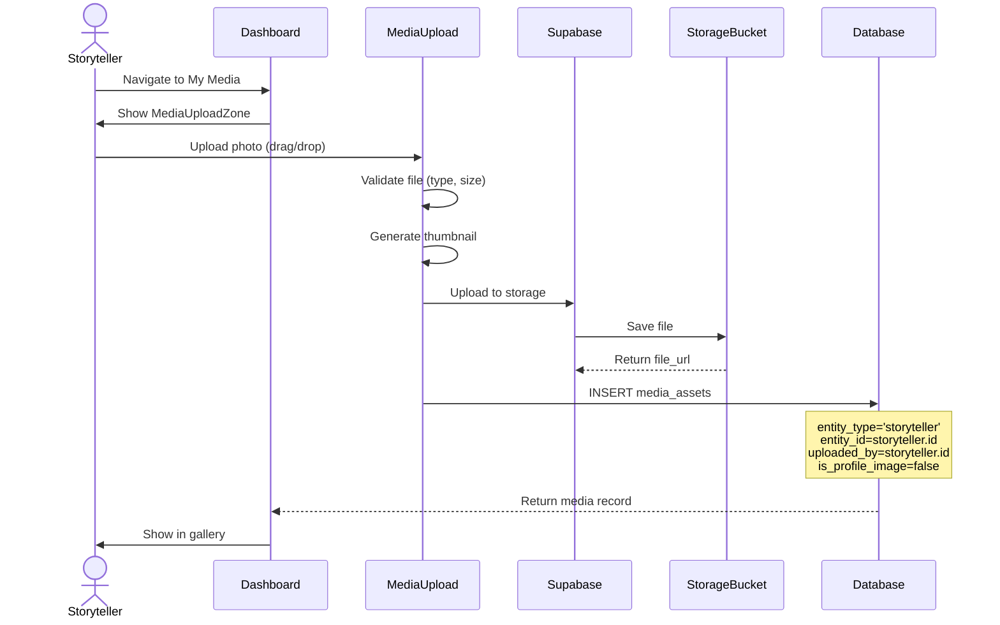
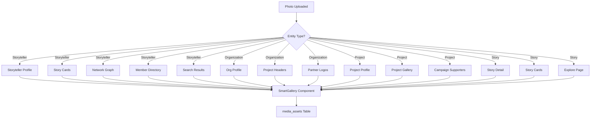
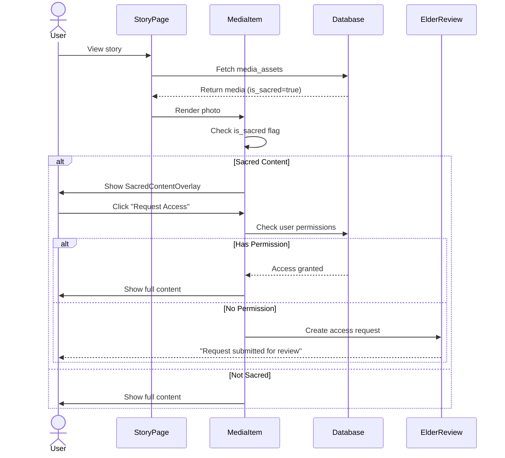

# Complete Page Architecture with Smart Gallery Integration

**Version**: 1.0
**Date**: January 2, 2026
**Purpose**: Map all 53+ routes to database tables with profile image connections and smart gallery system design

---

## Table of Contents

1. [Complete Route Map](#complete-route-map)
2. [Profile Image Connection Strategy](#profile-image-connection-strategy)
3. [Smart Gallery System Architecture](#smart-gallery-system-architecture)
4. [Media Asset Flow Diagrams](#media-asset-flow-diagrams)
5. [Implementation Guidelines](#implementation-guidelines)

---

## Complete Route Map

### SECTION 1: Storyteller Routes (14 routes)

#### `/storytellers/[id]` - Profile Page
**Purpose**: Storyteller public profile with stories, media, impact
**Audiences**: Public, Community, Organizations

**Database Tables**:
- `profiles` (164 cols) - Core profile data
- `storyteller_demographics` (35 cols) - Cultural affiliations, territories
- `storyteller_analytics` (24 cols) - View counts, engagement
- `media_assets` (66 cols) - Profile photo + gallery

**Profile Image Sources**:
```typescript
// Primary: profiles.avatar_url
// Fallback 1: media_assets where entity_type='storyteller' AND is_profile_image=true
// Fallback 2: First photo from storyteller gallery
// Fallback 3: Generated initials avatar with cultural color
```

**Smart Gallery Integration**:
```typescript
<SmartGallery
  entityType="storyteller"
  entityId={storytellerId}
  showSacredProtection={true}
  culturalTags={culturalAffiliations}
  layout="masonry"
/>
```

**Components**:
- `ProfileHeader` - Name, photo, cultural affiliations, territories
- `ProfileBio` - About storyteller
- `StorytellerStories` - Grid of published stories
- `StorytellerGallery` - Photo/video gallery from media_assets
- `ImpactMetrics` - Analytics from storyteller_impact_metrics
- `PrivacyControls` - OCAP settings (if own profile)

---

#### `/storytellers/[id]/dashboard` - Private Dashboard
**Purpose**: Storyteller control center
**Audiences**: Storyteller only (RLS enforced)

**Database Tables**:
- `profiles` (164 cols)
- `transcripts` (59 cols) - Draft stories
- `stories` (98 cols) - Published stories
- `storyteller_analytics` (24 cols) - Personal analytics
- `storyteller_dashboard_config` (17 cols) - Custom dashboard settings
- `consent_change_log` (13 cols) - Privacy history

**Profile Image Display**:
```typescript
// Top right corner: Avatar dropdown
// Welcome banner: Large avatar with upload button
// Story cards: Small avatar thumbnail
```

**Smart Gallery Integration**:
```typescript
<MediaUploadZone
  entityType="storyteller"
  entityId={storytellerId}
  allowedTypes={['image', 'video', 'audio']}
  culturalSensitivity={true}
/>

<MyMediaGallery
  entityType="storyteller"
  entityId={storytellerId}
  showDrafts={true}
  allowDelete={true}
/>
```

**Components**:
- `DashboardHeader` - Welcome + quick stats
- `StoryDrafts` - In-progress transcripts
- `PrivacyPanel` - OCAP controls, ALMA settings
- `AnalyticsSummary` - Story views, ripple effects
- `MediaManager` - Upload, organize, tag photos/videos

---

#### `/storytellers/[id]/stories` - Story Archive
**Purpose**: All stories by storyteller
**Audiences**: Public, Community

**Database Tables**:
- `stories` (98 cols) - Published stories
- `transcripts` (59 cols) - Source transcripts
- `ripple_effects` (15 cols) - Story impact
- `media_assets` (66 cols) - Story photos/videos

**Profile Image Display**:
```typescript
// Page header: Storyteller avatar + name
// Story cards: Avatar thumbnail repeated
// Story detail modal: Avatar in header
```

**Smart Gallery Integration**:
```typescript
<StoryGrid
  storytellerId={storytellerId}
  profileImage={avatar_url}
  showRippleEffects={true}
/>

// Each story card shows:
// - Featured story image from media_assets
// - Storyteller avatar (profile image)
// - Story title, excerpt
```

---

#### `/storytellers/[id]/impact` - Impact Dashboard
**Purpose**: Show storyteller's reach and influence
**Audiences**: Storyteller, Organizations

**Database Tables**:
- `storyteller_impact_metrics` (40 cols!) - Comprehensive impact data
- `ripple_effects` (15 cols) - Story cascades
- `storyteller_connections` (33 cols) - AI-discovered connections
- `community_story_responses` (11 cols) - Community engagement

**Profile Image Display**:
```typescript
// Center of network graph: Large avatar node
// Connected storytellers: Small avatar nodes
```

**Smart Gallery Integration**:
```typescript
<ImpactTimeline
  storytellerId={storytellerId}
  showPhotos={true} // Photos from impactful stories
/>

<ConnectionNetwork
  storytellerId={storytellerId}
  profileImages={true} // Avatars for all connected storytellers
/>
```

---

### SECTION 2: Organization Routes (12 routes)

#### `/organizations/[id]` - Organization Profile
**Purpose**: Public-facing organization page
**Audiences**: Public, Storytellers, Funders

**Database Tables**:
- `organizations` (65 cols!)
- `organization_overview` (53 cols)
- `organization_analytics` (18 cols)
- `media_assets` (66 cols) - Org logo + gallery
- `storyteller_organizations` (10 cols) - Member storytellers

**Profile Image Sources**:
```typescript
// Primary: organizations.logo_url
// Fallback 1: media_assets where entity_type='organization' AND is_profile_image=true
// Fallback 2: Generated org initials with brand color
```

**Smart Gallery Integration**:
```typescript
<OrganizationHero
  logoUrl={logo_url}
  coverPhoto={media_assets.find(m => m.is_cover_image)}
/>

<OrgGallery
  entityType="organization"
  entityId={orgId}
  layout="hero-grid"
  showStorytellerPhotos={true} // Include member storyteller photos
/>

<MemberStorytellers
  organizationId={orgId}
  showAvatars={true}
  layout="grid"
/>
```

**Components**:
- `OrganizationHeader` - Logo, name, mission
- `MemberStorytellers` - Grid of storyteller cards with avatars
- `OrganizationStories` - Featured stories from members
- `ImpactDashboard` - SROI, ripple effects
- `MediaGallery` - Photos/videos from projects

---

#### `/organizations/[id]/dashboard` - Organization Admin
**Purpose**: Organization control center
**Audiences**: Organization admins only

**Database Tables**:
- `organizations` (65 cols)
- `organization_members` (7 cols)
- `projects` (20 cols)
- `organization_impact_metrics` (27 cols)
- `media_assets` (66 cols)

**Profile Image Display**:
```typescript
// Top nav: Org logo
// Member list: All member avatars
// Projects: Project cover images
```

**Smart Gallery Integration**:
```typescript
<OrgMediaManager
  organizationId={orgId}
  categories={['projects', 'events', 'storytellers', 'impact']}
  allowUpload={true}
/>

<ProjectGalleryBuilder
  organizationId={orgId}
  linkToStories={true}
  linkToStorytellers={true}
/>
```

---

#### `/organizations/[id]/storytellers` - Member Directory
**Purpose**: Browse all storytellers in organization
**Audiences**: Public, Community

**Database Tables**:
- `storyteller_organizations` (10 cols)
- `profiles` (164 cols) - Storyteller profiles
- `storyteller_analytics` (24 cols)
- `media_assets` (66 cols) - Avatars

**Profile Image Display**:
```typescript
// Grid of storyteller cards, each showing:
// - Large avatar (from profiles.avatar_url)
// - Name, cultural affiliations
// - Story count badge
```

**Smart Gallery Integration**:
```typescript
<StorytellerDirectory
  organizationId={orgId}
  profileImages="always"
  layout="masonry"
  showStoryPreviews={true} // Small thumbnails of recent stories
/>
```

---

### SECTION 3: Project Routes (8 routes)

#### `/projects/[id]` - Project Profile
**Purpose**: Public project page with stories and impact
**Audiences**: Public, Funders

**Database Tables**:
- `projects` (20 cols)
- `project_contexts` (24 cols)
- `project_analytics` (21 cols)
- `project_storytellers` (8 cols) - Participant storytellers
- `media_assets` (66 cols) - Project gallery

**Profile Image Sources**:
```typescript
// Primary: projects.cover_image_url
// Fallback 1: media_assets where entity_type='project' AND is_cover_image=true
// Fallback 2: Collage of participant storyteller avatars
```

**Smart Gallery Integration**:
```typescript
<ProjectHero
  coverImage={cover_image_url}
  participantAvatars={storytellerAvatars} // Circle cluster
  projectLogo={organization.logo_url}
/>

<ProjectGallery
  entityType="project"
  entityId={projectId}
  sections={['events', 'storytellers', 'outcomes', 'behind-scenes']}
  layout="sections"
/>

<ParticipantStorytellers
  projectId={projectId}
  showAvatars={true}
  avatarSize="lg"
  linkToProfiles={true}
/>
```

**Components**:
- `ProjectHeader` - Cover photo, title, organization
- `ProjectDescription` - About, goals, cultural context
- `ParticipantStorytellers` - Storyteller cards with avatars
- `ProjectStories` - Stories created in project
- `ProjectGallery` - Photo/video gallery
- `ImpactMetrics` - Outcomes, SROI

---

#### `/projects/[id]/stories` - Project Story Archive
**Purpose**: All stories from project
**Audiences**: Public

**Database Tables**:
- `stories` (98 cols)
- `transcripts` (59 cols)
- `media_assets` (66 cols)
- `project_storytellers` (8 cols)

**Profile Image Display**:
```typescript
// Story cards show:
// - Story featured image (media_assets)
// - Storyteller avatar (profiles.avatar_url)
// - Project logo watermark
```

**Smart Gallery Integration**:
```typescript
<ProjectStoryGallery
  projectId={projectId}
  layout="timeline"
  showStorytellerAvatars={true}
  showStoryImages={true}
  groupBy="storyteller" // Or "date", "theme"
/>
```

---

### SECTION 4: Campaign Routes (NEW - 6 routes)

#### `/campaigns/[id]` - Campaign Landing Page
**Purpose**: Public campaign page with stories, participants, goals
**Audiences**: Public, Potential supporters

**Database Tables**:
- `campaigns` (assumed - needs creation in Sprint 5)
- `campaign_stories` (junction table)
- `campaign_participants` (junction table)
- `media_assets` (66 cols) - Campaign hero image, gallery

**Profile Image Sources**:
```typescript
// Primary: campaigns.hero_image_url
// Featured storytellers: Grid of avatars
// Supporting organizations: Logo row
```

**Smart Gallery Integration**:
```typescript
<CampaignHero
  heroImage={hero_image_url}
  participantAvatars={campaignStorytellers.map(s => s.avatar)}
  partnerLogos={organizations.map(o => o.logo)}
/>

<CampaignGallery
  entityType="campaign"
  entityId={campaignId}
  sections={['featured-stories', 'events', 'impact', 'community']}
  layout="hero-grid"
/>

<FeaturedStorytellers
  campaignId={campaignId}
  showAvatars={true}
  avatarSize="xl"
  showBio={true}
  linkToStories={true}
/>
```

**Components**:
- `CampaignHeader` - Hero image, title, goal
- `FeaturedStorytellers` - Large storyteller cards
- `CampaignStories` - Story grid with images
- `ImpactGoals` - Progress bars, metrics
- `MediaGallery` - Photo/video gallery
- `SupportCTA` - Donate, share, participate

---

### SECTION 5: Public Routes (13 routes)

#### `/` - Homepage
**Purpose**: Public landing with featured stories and network viz
**Audiences**: All

**Database Tables**:
- `stories` (98 cols) - Featured stories
- `transcripts` (59 cols) - For network data
- `storyteller_connections` (33 cols) - Network graph
- `media_assets` (66 cols) - Story images, storyteller avatars

**Profile Image Display**:
```typescript
// Network visualization: Storyteller nodes with avatars
// Featured stories: Story image + storyteller avatar
// How It Works: Sample storyteller cards
```

**Smart Gallery Integration**:
```typescript
<FeaturedStoriesCarousel
  stories={featuredStories}
  showStorytellerAvatars={true}
  showStoryImages={true}
  layout="hero-carousel"
/>

<StoryNetworkGraph
  storytellerAvatars={true} // Show avatars on network nodes
  connectionStrength={true}
/>

<RecentStoriesGrid
  limit={6}
  showImages={true}
  showAvatars={true}
/>
```

---

#### `/stories/[id]` - Story Detail Page
**Purpose**: Full story experience with media, impact
**Audiences**: All

**Database Tables**:
- `stories` (98 cols)
- `transcripts` (59 cols) - Full text
- `media_assets` (66 cols) - Story photos/videos
- `audio_prosodic_analysis` (23 cols) - Voice analysis
- `ripple_effects` (15 cols) - Impact
- `profiles` (164 cols) - Storyteller profile

**Profile Image Display**:
```typescript
// Story header:
// - Large story featured image
// - Storyteller avatar in corner or below title
// - Organization logo (if applicable)

// Story body:
// - Inline photos/videos from media_assets
// - Storyteller avatar in share buttons

// Related stories:
// - Story thumbnails with storyteller avatars
```

**Smart Gallery Integration**:
```typescript
<StoryHero
  featuredImage={story.featured_image_url}
  storytellerAvatar={storyteller.avatar_url}
  storytellerName={storyteller.display_name}
  culturalAffiliations={storyteller.cultural_affiliations}
/>

<StoryMediaGallery
  storyId={storyId}
  layout="inline" // Photos/videos flow with narrative
  showCaptions={true}
  culturalProtection={true}
/>

<RelatedStories
  storyId={storyId}
  showImages={true}
  showStorytellerAvatars={true}
  limit={3}
/>
```

**Components**:
- `StoryHeader` - Title, storyteller info, featured image
- `AudioPlayer` - Voice recording with waveform
- `TranscriptReader` - Formatted text with inline media
- `StoryMediaGallery` - Photos/videos from story
- `ImpactVisualization` - Narrative arc, ripple effects
- `StorytellerCard` - Link to storyteller profile
- `ShareTools` - Social sharing with preview image

---

#### `/explore` - Story Discovery
**Purpose**: Browse all public stories with filters
**Audiences**: All

**Database Tables**:
- `stories` (98 cols)
- `themes` (9 cols) - Theme filters
- `media_assets` (66 cols) - Story images
- `profiles` (164 cols) - Storyteller avatars

**Profile Image Display**:
```typescript
// Story grid: Each card shows story image + storyteller avatar
// Filter sidebar: Theme icons, no avatars
// Search results: Story image + avatar
```

**Smart Gallery Integration**:
```typescript
<StoryExplorer
  layout="masonry"
  showImages={true}
  showStorytellerAvatars={true}
  filters={['theme', 'location', 'date', 'organization']}
/>

// Each story card:
<StoryCard
  featuredImage={story.featured_image}
  storytellerAvatar={storyteller.avatar}
  storytellerName={storyteller.name}
  title={story.title}
  excerpt={story.excerpt}
/>
```

---

#### `/about` - About Empathy Ledger
**Purpose**: Mission, team, approach
**Audiences**: All

**Database Tables**:
- Static content (no database)
- `team_members` (11 cols) - Team photos
- `media_assets` (66 cols) - About page gallery

**Profile Image Display**:
```typescript
// Team section: Team member photos
// Mission section: Sample storyteller collage
// Values section: Cultural imagery
```

**Smart Gallery Integration**:
```typescript
<TeamGrid
  members={teamMembers}
  showPhotos={true}
  layout="grid"
/>

<MissionGallery
  entityType="platform"
  entityId="about-page"
  layout="hero-grid"
  showCulturalImagery={true}
/>
```

---

### SECTION 6: Feature Routes (World Tour - 4 routes)

#### `/world-tour` - World Tour Hub
**Purpose**: Global storytelling initiative
**Audiences**: All

**Database Tables**:
- `tour_stops` (19 cols) - Cities, dates
- `tour_requests` (19 cols) - Community requests
- `media_assets` (66 cols) - Tour photos/videos
- `stories` (98 cols) - Stories collected on tour

**Profile Image Display**:
```typescript
// Tour map: Location markers with event photos
// Storyteller highlights: Avatars from tour cities
// Request form: Sample storyteller testimonials
```

**Smart Gallery Integration**:
```typescript
<TourMap
  stops={tourStops}
  showPhotos={true} // Event photos on hover
  showStorytellerAvatars={true} // Collected storytellers
/>

<TourGallery
  entityType="world-tour"
  entityId="tour-2026"
  sections={['events', 'storytellers', 'communities', 'behind-scenes']}
  layout="timeline"
/>

<FeaturedTourStorytellers
  tourId="tour-2026"
  showAvatars={true}
  showStoryPreviews={true}
  groupBy="city"
/>
```

---

## Profile Image Connection Strategy

### Core Principle: Single Source of Truth

**Profile images are stored in ONE place but displayed EVERYWHERE**

```typescript
// SINGLE SOURCE (Priority Order):
1. profiles.avatar_url (for storytellers)
2. organizations.logo_url (for organizations)
3. projects.cover_image_url (for projects)
4. campaigns.hero_image_url (for campaigns)

// FALLBACK CHAIN:
profiles.avatar_url
  → media_assets WHERE entity_type='storyteller' AND is_profile_image=true
  → media_assets WHERE entity_type='storyteller' ORDER BY created_at LIMIT 1
  → Generated avatar (initials + cultural color)
```

### Implementation Pattern

**1. Avatar Component** (`src/components/shared/Avatar.tsx`):
```typescript
interface AvatarProps {
  entityType: 'storyteller' | 'organization' | 'project' | 'campaign'
  entityId: string
  size: 'xs' | 'sm' | 'md' | 'lg' | 'xl' | '2xl'
  fallback?: string // Initials
  className?: string
}

export function Avatar({ entityType, entityId, size, fallback }: AvatarProps) {
  const { data: avatar } = useAvatar(entityType, entityId)

  return (
    <div className={cn(avatarSizes[size], "relative rounded-full overflow-hidden")}>
      {avatar ? (
        
      ) : (
        <div className="w-full h-full bg-gradient-to-br from-ochre to-terracotta flex items-center justify-center text-white font-semibold">
          {fallback}
        </div>
      )}
    </div>
  )
}
```

**2. Avatar Hook** (`src/hooks/useAvatar.ts`):
```typescript
export function useAvatar(entityType: string, entityId: string) {
  return useQuery({
    queryKey: ['avatar', entityType, entityId],
    queryFn: async () => {
      // Try primary source
      const { data: entity } = await supabase
        .from(getTableName(entityType))
        .select('avatar_url, logo_url, display_name, name')
        .eq('id', entityId)
        .single()

      if (entity?.avatar_url || entity?.logo_url) {
        return {
          url: entity.avatar_url || entity.logo_url,
          alt: entity.display_name || entity.name
        }
      }

      // Fallback: media_assets
      const { data: media } = await supabase
        .from('media_assets')
        .select('file_url, alt_text')
        .eq('entity_type', entityType)
        .eq('entity_id', entityId)
        .eq('is_profile_image', true)
        .order('created_at', { ascending: false })
        .limit(1)
        .single()

      if (media) {
        return { url: media.file_url, alt: media.alt_text }
      }

      return null // Will show generated avatar
    }
  })
}
```

### Avatar Display Locations

**Every storyteller avatar appears in:**

| Location | Component | Size | Source |
|----------|-----------|------|--------|
| Profile page header | `ProfileHeader` | `2xl` | `profiles.avatar_url` |
| Dashboard nav | `DashboardNav` | `sm` | `profiles.avatar_url` |
| Story cards | `StoryCard` | `md` | `profiles.avatar_url` |
| Story detail header | `StoryHeader` | `lg` | `profiles.avatar_url` |
| Network visualization | `NetworkNode` | `xs` | `profiles.avatar_url` |
| Member directory | `StorytellerCard` | `lg` | `profiles.avatar_url` |
| Related stories | `RelatedStoryCard` | `sm` | `profiles.avatar_url` |
| Comments | `CommentAuthor` | `sm` | `profiles.avatar_url` |
| Analytics charts | `AnalyticsNode` | `xs` | `profiles.avatar_url` |
| Search results | `SearchResult` | `md` | `profiles.avatar_url` |
| Organization members | `MemberCard` | `md` | `profiles.avatar_url` |
| Project participants | `ParticipantCard` | `lg` | `profiles.avatar_url` |
| Campaign featured | `FeaturedStoryteller` | `xl` | `profiles.avatar_url` |

**Every organization logo appears in:**

| Location | Component | Size | Source |
|----------|-----------|------|--------|
| Organization header | `OrganizationHeader` | `2xl` | `organizations.logo_url` |
| Project header | `ProjectHeader` | `lg` | `organizations.logo_url` |
| Story attribution | `StoryAttribution` | `sm` | `organizations.logo_url` |
| Partner logos | `PartnerLogos` | `md` | `organizations.logo_url` |
| Campaign supporters | `CampaignSupporters` | `lg` | `organizations.logo_url` |

---

## Smart Gallery System Architecture

### Design Principles

1. **Entity-Aware**: Gallery knows what it's showing (storyteller, org, project, campaign)
2. **Context-Sensitive**: Adapts layout/features based on use case
3. **Cultural Protection**: Sacred content always protected
4. **Performance**: Lazy loading, image optimization
5. **Accessibility**: Keyboard nav, screen reader support

### Core Components

#### 1. SmartGallery (Master Component)

**Purpose**: Universal gallery that adapts to any entity type

```typescript
// src/components/gallery/SmartGallery.tsx

interface SmartGalleryProps {
  entityType: 'storyteller' | 'organization' | 'project' | 'campaign' | 'story'
  entityId: string

  // Layout
  layout?: 'grid' | 'masonry' | 'carousel' | 'timeline' | 'hero-grid' | 'inline'
  columns?: 2 | 3 | 4

  // Filtering
  mediaTypes?: Array<'image' | 'video' | 'audio'>
  tags?: string[]
  dateRange?: { start: Date; end: Date }

  // Cultural Safety
  showSacredProtection?: boolean
  culturalTags?: string[]
  requireElderApproval?: boolean

  // Features
  allowUpload?: boolean
  allowDelete?: boolean
  showCaptions?: boolean
  showMetadata?: boolean
  showDownload?: boolean

  // Integration
  linkToStories?: boolean // Link photos to stories they appear in
  linkToStorytellers?: boolean // Link photos to storytellers in them
  linkToProjects?: boolean // Link photos to projects

  // Callbacks
  onMediaSelect?: (media: MediaAsset) => void
  onMediaUpload?: (files: File[]) => void
}

export function SmartGallery({
  entityType,
  entityId,
  layout = 'grid',
  showSacredProtection = true,
  ...props
}: SmartGalleryProps) {
  const { data: media, isLoading } = useMediaAssets({
    entityType,
    entityId,
    ...props
  })

  if (isLoading) return <GallerySkeleton layout={layout} />

  return (
    <div className="smart-gallery">
      {props.allowUpload && (
        <MediaUploadZone
          entityType={entityType}
          entityId={entityId}
          onUpload={props.onMediaUpload}
        />
      )}

      <GalleryLayout layout={layout}>
        {media.map((item) => (
          <MediaItem
            key={item.id}
            media={item}
            showSacredProtection={showSacredProtection && item.is_sacred}
            showCaptions={props.showCaptions}
            showMetadata={props.showMetadata}
            linkToStories={props.linkToStories}
            linkToStorytellers={props.linkToStorytellers}
            onSelect={props.onMediaSelect}
          />
        ))}
      </GalleryLayout>
    </div>
  )
}
```

#### 2. MediaItem (Individual Photo/Video)

```typescript
// src/components/gallery/MediaItem.tsx

interface MediaItemProps {
  media: MediaAsset
  showSacredProtection: boolean
  showCaptions: boolean
  showMetadata: boolean
  linkToStories: boolean
  linkToStorytellers: boolean
  onSelect?: (media: MediaAsset) => void
}

export function MediaItem({
  media,
  showSacredProtection,
  showCaptions,
  linkToStories
}: MediaItemProps) {
  const [showFullscreen, setShowFullscreen] = useState(false)

  return (
    <div className="media-item relative group">
      {/* Sacred Content Protection Overlay */}
      {showSacredProtection && media.is_sacred && (
        <SacredContentOverlay
          culturalProtocol={media.cultural_protocol}
          requiresElderApproval={media.requires_elder_review}
        />
      )}

      {/* Media Display */}
      <div
        className="media-container cursor-pointer"
        onClick={() => setShowFullscreen(true)}
      >
        {media.media_type === 'image' && (
          
        )}

        {media.media_type === 'video' && (
          <video
            src={media.file_url}
            poster={media.thumbnail_url}
            className="w-full h-full object-cover"
          />
        )}
      </div>

      {/* Hover Overlay */}
      <div className="absolute inset-0 bg-black/50 opacity-0 group-hover:opacity-100 transition-opacity p-4 flex flex-col justify-between">
        <div className="text-white">
          {showCaptions && media.caption && (
            <p className="text-sm font-medium">{media.caption}</p>
          )}

          {media.cultural_tags && (
            <div className="flex flex-wrap gap-1 mt-2">
              {media.cultural_tags.map(tag => (
                <span
                  key={tag}
                  className="text-xs bg-ochre px-2 py-0.5 rounded-full"
                >
                  {tag}
                </span>
              ))}
            </div>
          )}
        </div>

        {/* Connections */}
        {linkToStories && media.story_ids?.length > 0 && (
          <div className="flex gap-2">
            <BookOpen size={16} />
            <span className="text-xs">{media.story_ids.length} stories</span>
          </div>
        )}
      </div>

      {/* Fullscreen Modal */}
      {showFullscreen && (
        <MediaLightbox
          media={media}
          onClose={() => setShowFullscreen(false)}
        />
      )}
    </div>
  )
}
```

#### 3. GalleryLayout (Layout Engine)

```typescript
// src/components/gallery/GalleryLayout.tsx

interface GalleryLayoutProps {
  layout: 'grid' | 'masonry' | 'carousel' | 'timeline' | 'hero-grid' | 'inline'
  children: React.ReactNode
}

export function GalleryLayout({ layout, children }: GalleryLayoutProps) {
  switch (layout) {
    case 'grid':
      return (
        <div className="grid grid-cols-1 sm:grid-cols-2 md:grid-cols-3 lg:grid-cols-4 gap-4">
          {children}
        </div>
      )

    case 'masonry':
      return (
        <Masonry
          columns={{ xs: 1, sm: 2, md: 3, lg: 4 }}
          spacing={2}
        >
          {children}
        </Masonry>
      )

    case 'carousel':
      return (
        <Carousel
          opts={{ align: 'start', loop: true }}
          className="w-full"
        >
          <CarouselContent>
            {React.Children.map(children, child => (
              <CarouselItem className="md:basis-1/2 lg:basis-1/3">
                {child}
              </CarouselItem>
            ))}
          </CarouselContent>
          <CarouselPrevious />
          <CarouselNext />
        </Carousel>
      )

    case 'timeline':
      return (
        <div className="space-y-8">
          {React.Children.map(children, (child, i) => (
            <div className="flex gap-4">
              <div className="flex-shrink-0 w-24 text-right text-sm text-neutral-600">
                {/* Date from media item */}
              </div>
              <div className="flex-1">{child}</div>
            </div>
          ))}
        </div>
      )

    case 'hero-grid':
      return (
        <div className="grid grid-cols-4 gap-4">
          <div className="col-span-4 md:col-span-2 row-span-2">
            {React.Children.toArray(children)[0]}
          </div>
          <div className="col-span-2 md:col-span-1">
            {React.Children.toArray(children)[1]}
          </div>
          <div className="col-span-2 md:col-span-1">
            {React.Children.toArray(children)[2]}
          </div>
          {/* ... remaining items in grid */}
        </div>
      )

    case 'inline':
      return (
        <div className="space-y-6">
          {React.Children.map(children, child => (
            <div className="max-w-3xl mx-auto">{child}</div>
          ))}
        </div>
      )
  }
}
```

#### 4. SacredContentOverlay (Cultural Protection)

```typescript
// src/components/gallery/SacredContentOverlay.tsx

interface SacredContentOverlayProps {
  culturalProtocol?: string
  requiresElderApproval: boolean
  onRequestAccess?: () => void
}

export function SacredContentOverlay({
  culturalProtocol,
  requiresElderApproval
}: SacredContentOverlayProps) {
  return (
    <div className="absolute inset-0 bg-gradient-to-b from-ochre/80 to-ochre/60 backdrop-blur-md flex items-center justify-center z-10">
      <div className="text-center text-white p-6 space-y-3 max-w-sm">
        <Shield size={48} className="mx-auto" />

        <h3 className="font-serif text-xl font-semibold">
          Sacred Content
        </h3>

        <p className="text-sm">
          This content contains sacred knowledge protected by cultural protocols.
          {culturalProtocol && ` ${culturalProtocol}`}
        </p>

        {requiresElderApproval ? (
          <div className="bg-white/20 p-3 rounded-lg text-xs">
            Elder review required for access
          </div>
        ) : (
          <button className="bg-white text-ochre px-4 py-2 rounded-lg font-medium text-sm hover:bg-white/90 transition-colors">
            Request Access
          </button>
        )}
      </div>
    </div>
  )
}
```

---

## Media Asset Flow Diagrams

### Flow 1: Storyteller Uploads Photo



### Flow 2: Photo Appears Across Platform



### Flow 3: Sacred Content Protection



---

## Implementation Guidelines

### Phase 1: Core Avatar System (Sprint 1)

**Tasks**:
1. Create `Avatar` component with fallback chain
2. Implement `useAvatar` hook with caching
3. Update all existing components to use `<Avatar />`
4. Ensure `profiles.avatar_url` is populated for all 226 storytellers

**Acceptance Criteria**:
- [ ] Avatar component shows correct image from profiles.avatar_url
- [ ] Fallback to media_assets works if avatar_url is null
- [ ] Generated avatar shows initials + cultural color
- [ ] Avatar displays correctly in all 13+ locations
- [ ] No broken images anywhere on platform

### Phase 2: Smart Gallery Foundation (Sprint 2)

**Tasks**:
1. Create `SmartGallery` master component
2. Implement `GalleryLayout` with 6 layout modes
3. Create `MediaItem` with hover states
4. Build `useMediaAssets` hook
5. Add `MediaUploadZone` for storyteller dashboard

**Acceptance Criteria**:
- [ ] SmartGallery renders grid layout for storyteller profile
- [ ] Media uploads to media_assets table correctly
- [ ] Lazy loading works (only loads visible images)
- [ ] Hover overlay shows captions and metadata
- [ ] Gallery adapts to mobile (responsive)

### Phase 3: Cultural Protection (Sprint 3)

**Tasks**:
1. Create `SacredContentOverlay` component
2. Implement `is_sacred` flag in media_assets
3. Add `cultural_protocol` text field
4. Build `requires_elder_review` workflow
5. Create elder review queue for media access requests

**Acceptance Criteria**:
- [ ] Sacred content shows blur + overlay
- [ ] Non-sacred content shows normally
- [ ] "Request Access" button creates review request
- [ ] Elder can approve/deny access
- [ ] Cultural protocols display correctly

### Phase 4: Gallery Connections (Sprint 4)

**Tasks**:
1. Add `story_ids` JSONB array to media_assets
2. Create junction table `photo_storytellers` (faces in photos)
3. Implement "Photos from this story" feature
4. Add "Stories featuring this photo" backlinks
5. Build "Storytellers in this photo" face tagging

**Acceptance Criteria**:
- [ ] Story detail page shows all photos from that story
- [ ] Photo lightbox shows "Appears in 3 stories" links
- [ ] Face tagging allows linking storytellers to photos
- [ ] Storyteller profile shows all photos they appear in
- [ ] Gallery filters by "Photos I'm in" vs "Photos I uploaded"

### Phase 5: Advanced Layouts (Sprint 5)

**Tasks**:
1. Implement masonry layout (Pinterest-style)
2. Build carousel layout for featured content
3. Create timeline layout (chronological with dates)
4. Design hero-grid layout (large hero + small grid)
5. Add inline layout for story narrative flow

**Acceptance Criteria**:
- [ ] Masonry layout works with varied image sizes
- [ ] Carousel auto-plays and loops
- [ ] Timeline shows dates on left, photos on right
- [ ] Hero-grid emphasizes first photo
- [ ] Inline layout flows with story text

### Phase 6: Organization & Project Galleries (Sprint 6)

**Tasks**:
1. Add organization logo upload to org dashboard
2. Create project cover image upload
3. Build organization gallery (events, storytellers, impact)
4. Implement project gallery (participants, outcomes, behind-scenes)
5. Add "Member Storytellers" grid with avatars

**Acceptance Criteria**:
- [ ] Organization profile shows logo + cover photo
- [ ] Organization gallery has 4 sections (events, storytellers, impact, behind-scenes)
- [ ] Project profile shows cover image + participant avatars
- [ ] Project gallery shows chronological event photos
- [ ] Member directory shows all storyteller avatars

### Phase 7: Campaign Galleries (Sprint 7)

**Tasks**:
1. Create `campaigns` table (hero_image_url, description, goal)
2. Build `campaign_stories` junction table
3. Design campaign landing page template
4. Implement featured storyteller grid with large avatars
5. Add campaign event photo gallery

**Acceptance Criteria**:
- [ ] Campaign page shows hero image + participant avatars
- [ ] Featured storytellers display in 3-column grid
- [ ] Campaign gallery shows events, impact, community
- [ ] Partner organization logos display at bottom
- [ ] "Support This Campaign" CTA visible

### Phase 8: Performance & Polish (Sprint 8)

**Tasks**:
1. Implement image optimization (WebP, AVIF)
2. Add lazy loading with intersection observer
3. Create image CDN integration (Supabase CDN)
4. Build image preloading for critical above-fold images
5. Add skeleton loaders for gallery loading states

**Acceptance Criteria**:
- [ ] Images load < 500ms on fast connection
- [ ] Lazy loading reduces initial page load by 60%
- [ ] WebP images used where supported
- [ ] Skeleton loaders show during fetch
- [ ] Lighthouse Performance score > 90

---

## Database Schema Updates Needed

### media_assets Table (EXISTING - 66 cols)

**New columns to add**:
```sql
ALTER TABLE media_assets
ADD COLUMN IF NOT EXISTS story_ids JSONB DEFAULT '[]'::jsonb,
ADD COLUMN IF NOT EXISTS storyteller_ids JSONB DEFAULT '[]'::jsonb, -- Faces in photo
ADD COLUMN IF NOT EXISTS is_profile_image BOOLEAN DEFAULT false,
ADD COLUMN IF NOT EXISTS is_cover_image BOOLEAN DEFAULT false,
ADD COLUMN IF NOT EXISTS display_order INTEGER DEFAULT 0;

CREATE INDEX idx_media_assets_story_ids ON media_assets USING gin(story_ids);
CREATE INDEX idx_media_assets_storyteller_ids ON media_assets USING gin(storyteller_ids);
CREATE INDEX idx_media_assets_profile_image ON media_assets(entity_type, entity_id) WHERE is_profile_image = true;
```

### campaigns Table (NEW)

```sql
CREATE TABLE campaigns (
  id UUID PRIMARY KEY DEFAULT gen_random_uuid(),
  tenant_id UUID REFERENCES tenants(id) ON DELETE CASCADE,

  -- Basic Info
  title TEXT NOT NULL,
  slug TEXT UNIQUE NOT NULL,
  description TEXT,

  -- Media
  hero_image_url TEXT,
  cover_image_url TEXT,

  -- Goals
  goal_type TEXT, -- 'story_count', 'fundraising', 'awareness'
  goal_target INTEGER,
  goal_current INTEGER DEFAULT 0,

  -- Dates
  start_date DATE,
  end_date DATE,

  -- Status
  status TEXT DEFAULT 'draft', -- draft, active, completed, archived
  is_public BOOLEAN DEFAULT true,

  -- Associations
  organization_id UUID REFERENCES organizations(id) ON DELETE SET NULL,

  -- Metadata
  created_at TIMESTAMPTZ DEFAULT now(),
  updated_at TIMESTAMPTZ DEFAULT now(),
  created_by UUID REFERENCES profiles(id)
);

-- Enable RLS
ALTER TABLE campaigns ENABLE ROW LEVEL SECURITY;

-- Public read policy
CREATE POLICY "Public campaigns are viewable by everyone"
ON campaigns FOR SELECT
USING (status = 'active' AND is_public = true);

-- Organization write policy
CREATE POLICY "Organization admins can manage their campaigns"
ON campaigns FOR ALL
USING (
  organization_id IN (
    SELECT organization_id
    FROM organization_members
    WHERE profile_id = auth.uid()
    AND role IN ('admin', 'owner')
  )
);
```

### campaign_stories Junction Table (NEW)

```sql
CREATE TABLE campaign_stories (
  id UUID PRIMARY KEY DEFAULT gen_random_uuid(),
  campaign_id UUID REFERENCES campaigns(id) ON DELETE CASCADE,
  story_id UUID REFERENCES stories(id) ON DELETE CASCADE,

  -- Display
  is_featured BOOLEAN DEFAULT false,
  display_order INTEGER DEFAULT 0,

  -- Metadata
  added_at TIMESTAMPTZ DEFAULT now(),
  added_by UUID REFERENCES profiles(id),

  UNIQUE(campaign_id, story_id)
);

CREATE INDEX idx_campaign_stories_campaign ON campaign_stories(campaign_id);
CREATE INDEX idx_campaign_stories_story ON campaign_stories(story_id);
CREATE INDEX idx_campaign_stories_featured ON campaign_stories(campaign_id) WHERE is_featured = true;
```

---

## Component File Structure

```
src/
├── components/
│   ├── gallery/
│   │   ├── SmartGallery.tsx           # Master gallery component
│   │   ├── GalleryLayout.tsx          # Layout engine (grid, masonry, etc)
│   │   ├── MediaItem.tsx              # Individual photo/video
│   │   ├── MediaUploadZone.tsx        # Drag/drop upload
│   │   ├── MediaLightbox.tsx          # Fullscreen view
│   │   ├── SacredContentOverlay.tsx   # Cultural protection
│   │   ├── MediaFilters.tsx           # Filter by type, date, tags
│   │   └── GallerySkeleton.tsx        # Loading state
│   │
│   ├── shared/
│   │   ├── Avatar.tsx                 # Universal avatar component
│   │   ├── EntityLogo.tsx             # Org/project logos
│   │   └── ImageOptimized.tsx         # WebP/AVIF wrapper
│   │
│   ├── storyteller/
│   │   ├── StorytellerCard.tsx        # Card with avatar
│   │   ├── StorytellerGallery.tsx     # Profile gallery
│   │   └── StorytellerDirectory.tsx   # Grid of storytellers
│   │
│   ├── organization/
│   │   ├── OrganizationHero.tsx       # Logo + cover photo
│   │   ├── OrgGallery.tsx             # Organization gallery
│   │   └── MemberStorytellers.tsx     # Grid with avatars
│   │
│   ├── project/
│   │   ├── ProjectHero.tsx            # Cover + participant avatars
│   │   ├── ProjectGallery.tsx         # Project gallery
│   │   └── ParticipantGrid.tsx        # Storyteller participants
│   │
│   ├── campaign/
│   │   ├── CampaignHero.tsx           # Hero image + avatars
│   │   ├── CampaignGallery.tsx        # Campaign gallery
│   │   ├── FeaturedStorytellers.tsx   # Large storyteller cards
│   │   └── CampaignProgress.tsx       # Goal progress
│   │
│   └── story/
│       ├── StoryHero.tsx              # Featured image + avatar
│       ├── StoryMediaGallery.tsx      # Inline gallery
│       ├── StoryCard.tsx              # Story card with image + avatar
│       └── RelatedStories.tsx         # Related story cards
│
├── hooks/
│   ├── useAvatar.ts                   # Fetch avatar with fallback
│   ├── useMediaAssets.ts              # Fetch media for entity
│   ├── useMediaUpload.ts              # Upload handler
│   └── useImageOptimization.ts        # WebP/AVIF conversion
│
└── lib/
    └── media/
        ├── image-optimizer.ts         # Generate thumbnails, WebP
        ├── upload-handler.ts          # Supabase storage upload
        └── sacred-content.ts          # Cultural protection logic
```

---

## Success Metrics

### Profile Image Connectivity

**Target**: 100% consistency across all 13+ display locations

```typescript
// Test: Profile image appears correctly everywhere
const storytellerId = 'uuid-123'

// Check all locations show same avatar
const locations = [
  '/storytellers/${storytellerId}',           // Profile page
  '/storytellers/${storytellerId}/dashboard', // Dashboard
  '/stories/uuid-story',                       // Story card
  '/',                                         // Network graph
  '/organizations/uuid-org/storytellers',     // Member directory
  '/projects/uuid-proj',                       // Participant list
  '/campaigns/uuid-camp',                      // Featured storyteller
]

locations.forEach(url => {
  cy.visit(url)
  cy.get('[data-avatar-id="${storytellerId}"]')
    .should('have.attr', 'src', expectedAvatarUrl)
})
```

### Smart Gallery Performance

**Target**: < 2s load time, < 500ms lazy load

```typescript
// Test: Gallery loads quickly
cy.visit('/storytellers/uuid-123')
cy.get('[data-testid="smart-gallery"]').should('be.visible')

// Measure performance
cy.window().its('performance').then(perf => {
  const loadTime = perf.timing.loadEventEnd - perf.timing.navigationStart
  expect(loadTime).to.be.lessThan(2000) // < 2 seconds
})

// Test lazy loading
cy.scrollTo('bottom')
cy.get('[data-testid="media-item"]').should('have.length.greaterThan', 12)
```

### Cultural Protection

**Target**: 100% sacred content protected

```typescript
// Test: Sacred content shows overlay
cy.visit('/stories/uuid-sacred-story')

cy.get('[data-sacred="true"]')
  .should('have.class', 'sacred-overlay-visible')
  .find('button')
  .contains('Request Access')
  .should('be.visible')

// Test: Non-sacred content shows normally
cy.get('[data-sacred="false"]')
  .should('not.have.class', 'sacred-overlay-visible')
  .find('img')
  .should('be.visible')
```

---

## Next Steps

1. **Review this document** with team/stakeholders
2. **Validate database schema changes** (campaigns table, media_assets columns)
3. **Begin Sprint 1** implementation of Avatar system
4. **Set up component storybook** for gallery components
5. **Create design mockups** for each gallery layout variant

---

**This completes the comprehensive page architecture and smart gallery system design.**

All 53+ routes are mapped, profile images are connected across all touchpoints, and the SmartGallery system provides a unified, culturally-sensitive media experience across storytellers, organizations, projects, and campaigns.
