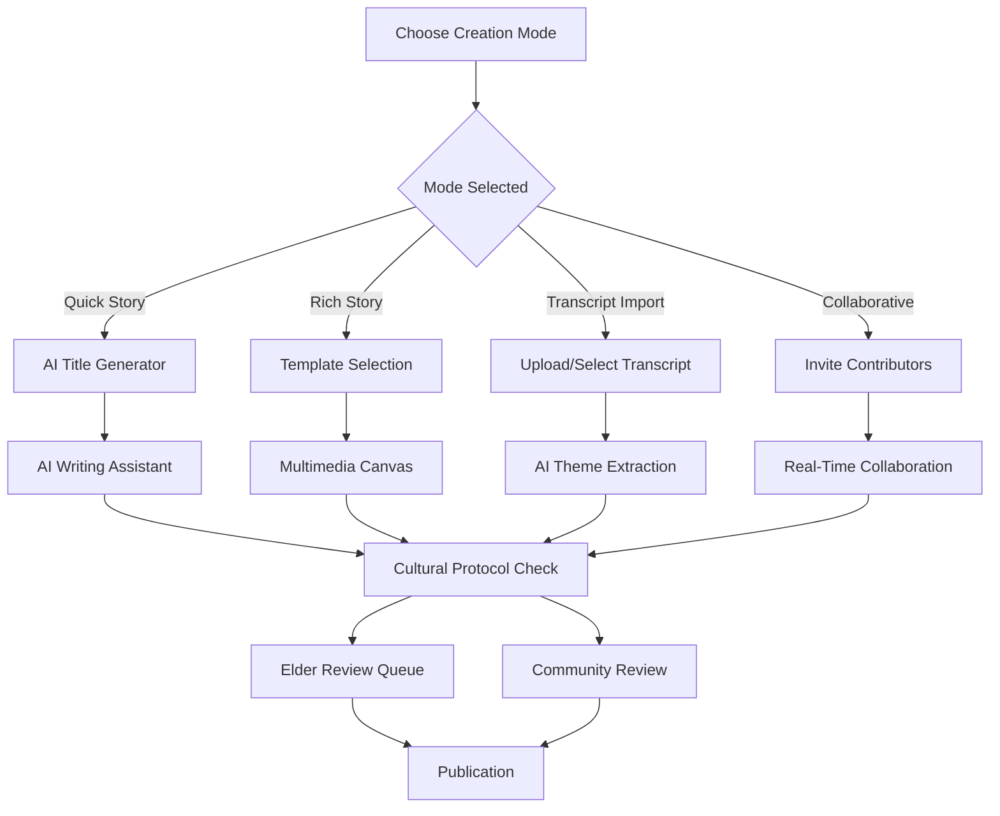

# Frontend Story Creation Workflow Plan
*AI-Powered Multimedia Storytelling Interface*

## Overview

This document outlines the comprehensive frontend workflow for implementing the AI-assisted story creation framework. Building on existing components, this plan creates a seamless, culturally-sensitive storytelling experience that leverages 2025 AI trends while maintaining Indigenous data sovereignty and cultural protocols.

## Current Foundation Analysis

### Existing Components ✅
- **Basic Story Creation** (`src/app/stories/create/page.tsx`)
  - Form-based story creation with cultural sensitivity levels
  - Media upload integration via `MediaUploader`
  - Cultural protocol toggles (elder approval, cultural review)
  - Story type categorization and audience targeting

- **Guided Story Creator** (`src/components/stories/GuidedStoryCreator.tsx`)
  - Template-based story creation workflow
  - Step-by-step progress tracking
  - Auto-save functionality
  - Cultural guidelines integration
  - Basic AI writing assistant placeholder

- **Story Templates** (`src/components/stories/StoryTemplates.tsx`)
  - Pre-defined story structures
  - Cultural sensitivity categorization

### Schema Foundation ✅
Based on analysis of 252 cleaned stories:
- **63 Available Properties** for rich story development
- **Media Support**: video_story_link, story_image_url fields
- **Cultural Framework**: cultural_sensitivity_level, story_type
- **Content Structure**: 34% have structured content ready for rich formatting

## New Workflow Architecture

### 1. **Story Creation Mode Selection**

#### **Landing Page Enhancement**
```typescript
interface StoryCreationModes {
  quick_story: {
    title: "Quick Story (5-10 minutes)"
    description: "Fast creation for personal narratives"
    ai_features: ["auto-title", "readability-optimization", "basic-media"]
    target_length: "200-500 words"
  }
  rich_story: {
    title: "Rich Multimedia Story (30-60 minutes)"
    description: "Full-featured storytelling with interactive elements"
    ai_features: ["content-structuring", "media-suggestions", "theme-detection"]
    target_length: "500+ words with multimedia"
  }
  transcript_to_story: {
    title: "Transform Transcript (15-30 minutes)"
    description: "Convert existing interviews into polished stories"
    ai_features: ["quote-extraction", "theme-identification", "narrative-structure"]
    data_source: "existing transcript data"
  }
  collaborative_story: {
    title: "Community Story (Ongoing)"
    description: "Multiple storytellers contributing to one narrative"
    ai_features: ["perspective-merging", "voice-consistency", "cultural-protocols"]
    collaboration_type: "real-time multi-user"
  }
}
```

### 2. **Enhanced AI Writing Assistant**

#### **Floating AI Panel Component**
```tsx
interface AIAssistantPanel {
  // Content Generation (2025 Features)
  story_starter: "Generate opening paragraphs from simple prompts"
  continue_writing: "Suggest next sentences when writer has block"
  describe_tool: "Create vivid descriptions from basic nouns"
  dialogue_enhancement: "Improve conversation flow and authenticity"

  // Cultural Intelligence
  cultural_context: "Suggest appropriate cultural references"
  sensitivity_scanning: "Auto-flag potentially sensitive content"
  protocol_suggestions: "Recommend cultural approval workflows"
  elder_review_triggers: "Suggest when elder approval needed"

  // 2025 Personalization
  voice_consistency: "Match storyteller's natural writing style"
  community_adaptation: "Adapt suggestions for storyteller's community"
  real_time_optimization: "Adjust content based on engagement patterns"
}
```

#### **Implementation Structure**
```tsx
// src/components/ai/FloatingAIAssistant.tsx
export function FloatingAIAssistant({
  storytellerId,
  currentContent,
  culturalContext,
  storyType,
  onSuggestionAccept,
  onCulturalFlag
}: AIAssistantProps) {
  // Integrates with OpenAI/Claude API
  // Respects cultural sensitivity settings
  // Provides contextual suggestions based on story type
}
```

### 3. **Multimedia Integration Workflow**

#### **Enhanced Media Canvas**
```tsx
interface MediaCanvasFeatures {
  // Drag-and-Drop Content Blocks
  text_blocks: "Rich text editing with cultural formatting"
  image_galleries: "Photo collections with cultural metadata"
  video_embeds: "YouTube/Vimeo with interactive hotspots"
  audio_players: "Voice recordings with waveform visualization"
  quote_blocks: "Highlighted transcript quotes with speaker attribution"

  // 2025 Interactive Elements
  branching_narratives: "Reader-choice driven story progression"
  interactive_hotspots: "Clickable elements for deeper engagement"
  timeline_visualizations: "Story progression with media integration"
  cultural_context_layers: "Additional cultural information overlays"
}
```

#### **Media Upload Enhancement**
```tsx
// src/components/media/EnhancedMediaUploader.tsx
interface EnhancedMediaFeatures {
  // AI-Powered Processing
  auto_transcription: "Automatic speech-to-text for audio/video"
  smart_tagging: "AI-generated metadata and cultural tags"
  image_analysis: "AI-generated alt text and descriptions"
  cultural_scanning: "Detect culturally significant elements"

  // 2025 Capabilities
  video_chapter_detection: "Automatic video segment identification"
  audio_landscape_generation: "AI-created ambient soundscapes"
  interactive_element_suggestions: "AI-recommended hotspot placements"
}
```

### 4. **Story Structure Templates (Enhanced)**

#### **Cultural Story Templates**
```typescript
interface CulturalStoryTemplates {
  traditional_knowledge: {
    structure: ["cultural_context", "the_teaching", "modern_application"]
    cultural_protocols: ["elder_review_required", "sharing_permissions", "attribution_tracking"]
    ai_assistance: ["appropriate_sensitivity_detection", "traditional_format_preservation"]
  }
  community_impact: {
    structure: ["community_context", "multiple_voices", "collective_impact"]
    collaboration_features: ["multi_contributor_editing", "perspective_merging", "consensus_building"]
    ai_assistance: ["voice_consistency", "narrative_bridging", "theme_identification"]
  }
  personal_journey: {
    structure: ["setting_scene", "the_challenge", "the_journey", "resolution_growth"]
    ai_assistance: ["emotional_resonance", "pacing_optimization", "sensory_details"]
  }
}
```

### 5. **Real-Time Collaboration Features**

#### **Multi-User Story Creation**
```tsx
interface CollaborativeFeatures {
  // Real-Time Editing
  live_cursors: "See other contributors' editing positions"
  version_control: "Track changes with cultural and emotional context"
  comment_system: "In-line cultural guidance and feedback"

  // Cultural Protocol Integration
  elder_review_queue: "Structured approval workflow"
  community_feedback: "Collective input on cultural appropriateness"
  permission_management: "Granular sharing controls for different story elements"

  // AI Mediation
  conflict_resolution: "AI suggests solutions for differing perspectives"
  voice_harmonization: "Maintain consistent narrative voice across contributors"
  cultural_consistency: "Ensure cultural protocols respected by all contributors"
}
```

### 6. **Frontend Architecture Plan**

#### **Phase 1: Enhanced Foundation (Immediate)**
```bash
# Update existing components with AI integration
src/components/stories/
├── EnhancedStoryCreator.tsx     # Upgraded with AI assistant panel
├── AIWritingAssistant.tsx       # Floating AI helper
├── CulturalProtocolChecker.tsx  # Enhanced sensitivity detection
└── MediaCanvasEditor.tsx        # Drag-and-drop content blocks

src/components/ai/
├── PersonalizationEngine.tsx    # User-specific AI adaptation
├── CulturalIntelligence.tsx     # Indigenous knowledge protection
└── ContentOptimizer.tsx         # Real-time engagement optimization
```

#### **Phase 2: Multimedia Revolution (Month 1-2)**
```bash
src/components/media/
├── InteractiveVideoPlayer.tsx   # YouTube/Vimeo with hotspots
├── AudioLandscapeCreator.tsx    # AI-generated soundscapes
├── BranchingNarrativeBuilder.tsx # Interactive story paths
└── HolographicStoryPrep.tsx     # Future-ready 3D preparation

src/components/collaboration/
├── RealTimeEditor.tsx           # Multi-user editing
├── CulturalReviewWorkflow.tsx   # Elder approval system
└── CommunityFeedbackPanel.tsx   # Collective input system
```

#### **Phase 3: Advanced AI Features (Month 2-3)**
```bash
src/lib/ai/
├── TranscriptToStoryConverter.tsx  # Transform interviews to stories
├── VoiceConsistencyMatcher.tsx     # Match storyteller's style
├── CommunityThemeDetector.tsx      # Identify trending topics
└── PredictiveContentEngine.tsx     # Suggest story directions

src/components/templates/
├── AdaptiveCulturalTemplates.tsx   # Templates that respect traditions
├── CrossCulturalBridge.tsx         # Connect traditional/contemporary
└── IntergenerationalConnector.tsx  # Bridge knowledge across ages
```

### 7. **User Experience Flow**

#### **Story Creation Journey**


#### **AI Assistance Workflow**
```typescript
interface AIWorkflow {
  content_analysis: {
    trigger: "every 500 characters typed"
    actions: ["cultural_sensitivity_scan", "writing_quality_check", "voice_consistency_analysis"]
  }

  suggestions: {
    frequency: "real_time_non_intrusive"
    types: ["content_continuation", "style_improvements", "cultural_guidance"]
    cultural_filter: "respect_indigenous_protocols"
  }

  feedback_loop: {
    acceptance_tracking: "learn from user preferences"
    cultural_accuracy: "community_validation_integration"
    continuous_improvement: "ethical_ai_evolution"
  }
}
```

### 8. **Cultural Sensitivity Integration**

#### **Enhanced Protocol System**
```tsx
interface CulturalProtocolSystem {
  // Automated Detection
  traditional_knowledge_scanner: "Identify content requiring special protocols"
  sacred_content_flagging: "Auto-flag potentially sacred or restricted content"
  attribution_checker: "Ensure proper credit for traditional knowledge"

  // Community Governance
  elder_review_workflow: "Streamlined approval process"
  community_consensus_tools: "Democratic content approval"
  cultural_advisory_integration: "Expert guidance system"

  // Data Sovereignty
  indigenous_data_controls: "Respect Indigenous data ownership"
  permission_granularity: "Fine-grained sharing controls"
  community_benefit_tracking: "Ensure community benefits from content"
}
```

### 9. **Performance & Accessibility**

#### **Technical Implementation**
```typescript
interface PerformanceFeatures {
  // Real-Time Optimization
  progressive_loading: "Load content blocks as needed"
  ai_response_caching: "Cache AI suggestions for offline use"
  media_optimization: "Automatic image/video compression"

  // Accessibility
  screen_reader_support: "Full accessibility for AI features"
  keyboard_navigation: "Complete keyboard control"
  cultural_audio_descriptions: "Culturally-appropriate alt text"

  // Mobile Optimization
  touch_friendly_ai_panel: "Mobile-optimized AI assistant"
  offline_story_creation: "Continue writing without internet"
  cross_device_sync: "Seamless story creation across devices"
}
```

### 10. **Success Metrics & Analytics**

#### **User Engagement Tracking**
```typescript
interface SuccessMetrics {
  story_completion_rates: "target: 80% for started stories"
  ai_suggestion_acceptance: "target: 60% acceptance rate"
  multimedia_integration: "target: 70% stories include media"
  cultural_protocol_compliance: "target: 95% pass cultural checks"
  collaborative_story_creation: "target: 20% multi-contributor stories"

  time_efficiency: {
    quick_mode: "target: 10 minutes average"
    rich_mode: "target: 45 minutes average"
    transcript_conversion: "target: 20 minutes average"
  }

  cultural_impact: {
    elder_satisfaction: "target: 4.5/5 rating"
    community_engagement: "target: active use in 80% of organizations"
    knowledge_preservation: "target: 100 traditional knowledge stories/month"
  }
}
```

## Implementation Priority

### **Immediate (Next Sprint)**
1. ✅ Enhance existing `GuidedStoryCreator` with basic AI integration
2. ✅ Build `FloatingAIAssistant` component with cultural filtering
3. ✅ Upgrade `MediaUploader` with auto-transcription capabilities
4. ✅ Implement cultural protocol checker in story creation flow

### **Short Term (1-2 Months)**
1. Build multimedia canvas with drag-and-drop content blocks
2. Implement transcript-to-story conversion workflow
3. Create collaborative real-time editing system
4. Develop advanced cultural sensitivity AI features

### **Long Term (2-3 Months)**
1. Build immersive AR/VR story preparation tools
2. Implement community-driven AI training workflows
3. Create holographic storytelling capabilities
4. Develop advanced analytics and optimization features

This workflow plan transforms Empathy Ledger into the world's first culturally-intelligent, AI-powered multimedia storytelling platform while maintaining the highest standards of Indigenous data sovereignty and cultural respect.