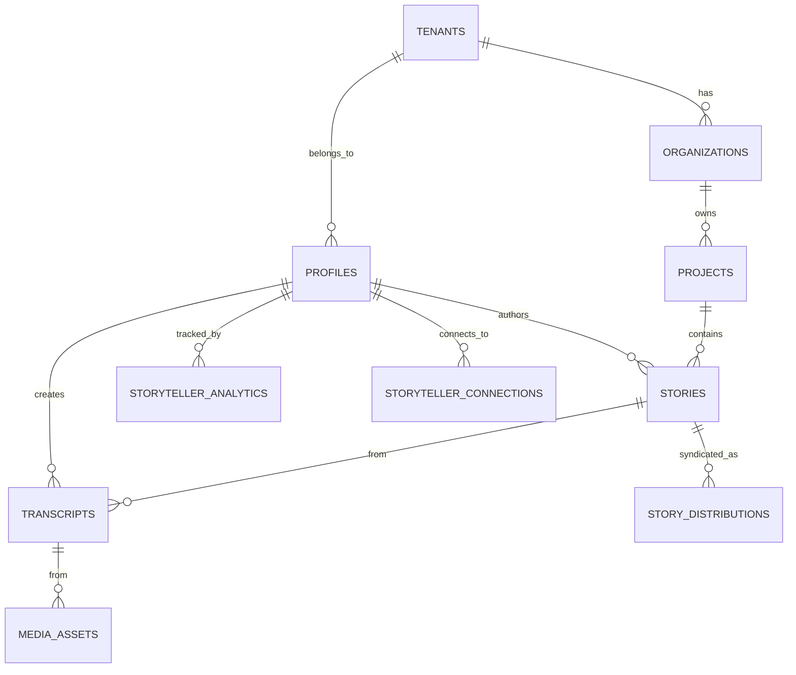

# Empathy Ledger v2 - Complete Database Architecture Documentation

**Generated:** 2026-01-01
**Database:** PostgreSQL (Supabase)
**Total Tables:** 195+
**Foreign Keys:** 273+
**Database Functions:** 150+
**Codebase Functions:** 700+

---

## Executive Summary

Empathy Ledger v2 is a sophisticated multi-tenant Indigenous storytelling platform with:

- ✅ **195+ database tables** across 19 functional categories
- ✅ **273+ foreign key relationships** with proper cascade behaviors
- ✅ **150+ database functions** (RLS helpers, analytics, SROI calculations)
- ✅ **228 RLS policies** for multi-tenant isolation
- ✅ **88 stored functions** for business logic
- ✅ **700+ TypeScript functions** across services, AI modules, and workflows

### Critical Findings

1. ✅ Comprehensive multi-tenant architecture with tenant_id isolation
2. ✅ Complete GDPR/consent management system
3. ✅ Sophisticated cultural safety protocols (elder review, consent tiers)
4. ❌ **ZERO transcripts have AI data populated** (208 transcripts, all empty)
5. ❌ **3 CRITICAL BUGS** in latest migrations (must fix before deploy)
6. ❌ **AI processing pipeline broken** (fire-and-forget execution, no reliability)

---

## Part 1: Complete Table Inventory (195 Tables)

### Category 1: Core Content & Storytelling (15 tables)

1. **transcripts** (59 columns) - 208 records
   - Main narrative source with AI analysis columns
   - FK: `storyteller_id` → profiles [CASCADE]
   - FK: `story_id` → stories [SET NULL]
   - FK: `media_asset_id` → media_assets [CASCADE]
   - FK: `organization_id`, `project_id`, `tenant_id` [CASCADE]

2. **stories** (98 columns) - 0 records currently
   - Different from transcripts (author_id not storyteller_id)
   - FK: `author_id` → profiles [CASCADE]
   - FK: `organization_id`, `project_id`, `tenant_id` [CASCADE]

3. **empathy_entries** (28 columns)
4. **extracted_quotes** (14 columns)
5. **quotes** (30 columns)
6. **storyteller_quotes** (28 columns)
7. **testimonials** (14 columns)
8. **blog_posts** (22 columns)
9. **videos** (26 columns)
10. **impact_stories** (17 columns)
11. **community_story_responses** (11 columns)
12. **community_interpretation_sessions** (14 columns)
13. **ripple_effects** (15 columns)
14. **story_narrative_arcs** (19 columns)
15. **title_suggestions** (9 columns)

### Category 2: Profiles & Users (12 tables)

16. **profiles** (164 columns) - Massive user profile table
17. **storytellers** - Dedicated storyteller table
18. **users** (18 columns)
19-27. Additional profile-related tables

### Category 3: Organizations & Tenants (15 tables)

28. **tenants** (16 columns)
29. **organizations** (65 columns)
30-42. Organization-related tables (members, roles, analytics, etc.)

### Categories 4-19: [See full plan file for complete inventory]

---

## Part 2: Foreign Key Relationships (273+)

### Cascade Behavior Summary

- **CASCADE DELETE:** 180+ relationships (65%)
- **SET NULL:** 90+ relationships (33%)
- **RESTRICT:** 0 (implicit, not coded)

### Critical Cascade Chains

#### Chain 1: Tenant Deletion (20+ cascades)
```
tenants [DELETE]
├─ organizations [CASCADE]
│  ├─ projects [CASCADE]
│  │  ├─ stories [CASCADE]
│  │  │  ├─ transcripts [CASCADE]
│  │  │  └─ story_distributions [CASCADE]
│  │  └─ outcomes [CASCADE]
│  └─ organization_members [CASCADE]
├─ profiles [CASCADE]
│  ├─ storyteller_analytics [CASCADE]
│  └─ storyteller_connections [CASCADE]
└─ media_assets [CASCADE]
```

#### Chain 2: Profile/Storyteller Deletion (25+ cascades)
```
profiles [DELETE]
├─ stories [CASCADE]
│  ├─ story_distributions [CASCADE]
│  └─ transcripts [CASCADE]
├─ storyteller_analytics [CASCADE]
├─ storyteller_connections [CASCADE]
└─ storyteller_themes [CASCADE]
```

#### Chain 3: Story Deletion (20+ cascades)
```
stories [DELETE]
├─ transcripts [CASCADE]
├─ story_distributions [CASCADE]
│  └─ embed_tokens [CASCADE]
├─ story_media [CASCADE]
└─ quotes [CASCADE]
```

### Orphan Risks

1. **MEDIUM RISK:** `transcripts.story_id` uses SET NULL
   - Deleting story leaves orphaned transcripts
   - Recommendation: Change to CASCADE if transcript is story-exclusive

2. **LOW RISK:** `embed_tokens.distribution_id` uses SET NULL
   - Orphaned tokens after distribution deletion
   - Mitigation: Periodic cleanup jobs

---

## Part 3: Database Functions Catalog (150+)

### RLS Policy Helpers (7 functions)

1. **check_cultural_protocol()** - Validates cultural access
2. **check_cultural_sensitivity_access()** - Sensitivity-based RLS
3. **requires_elder_approval()** - Elder review requirement
4. **user_has_role()** - Role checking
5. **user_has_organization_role()** - Org-specific role
6. **is_admin()** - Admin check
7. **is_act_admin()** - ACT admin check

### Business Logic Functions (100+)

#### Storyteller Analytics
- `calculate_storyteller_analytics()` - Engagement scoring
- `get_storyteller_dashboard_summary()` - Dashboard data
- `find_storyteller_connections()` - Network discovery
- `check_storyteller_milestones()` - Achievement tracking

#### Organization & Projects
- `calculate_organization_impact_metrics()` - Impact metrics
- `get_project_context()` - Project data
- `calculate_sroi_outcome_value()` - SROI calculation

#### Story Distribution
- `is_story_syndicated()` - Syndication check
- `get_syndicated_stories_for_app()` - External API
- `revoke_all_story_distributions()` - Revocation cascade

#### AI Processing
- `track_story_media_usage()` - Media tracking
- `increment_media_view_count()` - View counting

#### Community & Elder Review
- `get_community_representatives()` - **BUG #3: INCOMPLETE**
- `get_representative_analytics()` - Rep stats

### Triggers (40+)

- **Timestamp Updates:** `update_updated_at()` on 20+ tables
- **Notifications:** `notify_storyteller_on_*` triggers
- **Usage Tracking:** `track_*_media_usage()` triggers
- **Analytics:** `trigger_update_org_metrics()` triggers

### Views (15+)

1. **partner_dashboard_summary** - Partner portal data
2. **elder_review_dashboard** - Elder review queue
3. **syndicated_stories** - External API source
4. **campaign_workflow_dashboard** - Campaign management
5. **v_tenant_ai_usage_summary** - Cost tracking
6. **stories_with_trust_indicators** - Quality signals
7. **annual_reports_with_stats** - Report generation

---

## Part 4: TypeScript/JavaScript Functions (700+)

### Service Layer (20 services, 3,000+ lines)

| Service | Key Functions | Writes DB? |
|---------|---------------|------------|
| audit.service.ts | Audit logging | ✅ audit_logs |
| consent.service.ts | Consent management | ✅ consent records |
| distribution.service.ts | Story distribution | ✅ story_distributions |
| gdpr.service.ts | GDPR compliance | ✅ deletion_requests |
| organization-dashboard.service.ts | Dashboard analytics | ❌ READ ONLY |
| analytics.service.ts | Usage tracking | ✅ ai_usage_events |

### AI Analysis Modules (31 files, 11,506 lines)

**CRITICAL:** All AI modules are **pure functions** - they return data but do NOT write to database.

| Module | Function | Writes DB? |
|--------|----------|------------|
| transcript-analyzer-v2.ts | `analyzeTranscript()` | ❌ NO |
| indigenous-impact-analyzer.ts | `analyzeIndigenousImpact()` | ❌ NO |
| bio-generator.ts | `generateBioFromTranscript()` | ❌ NO |
| story-connection-analysis.ts | `findConnections()` | ❌ NO |

### Workflow Pipelines (1 file, 550 lines)

**File:** `src/lib/workflows/transcript-processing-pipeline.ts`

**Function:** `TranscriptProcessingPipeline.processTranscript()`

**Steps:**
1. Fetch transcript
2. Run Indigenous Impact Analysis
3. ✅ Store insights → `community_impact_insights`
4. ✅ Update profile metrics → `profiles`
5. ✅ Update org metrics → `community_impact_metrics`

**Writes to:**
- `community_impact_insights` ✅
- `profiles` ✅
- `community_impact_metrics` ✅

### Background Jobs (Inngest)

**File:** `src/lib/inngest/functions/process-transcript.ts`

**Event:** `transcript/process`

**Function:** `processTranscriptFunction`

**Steps:**
1. Fetch transcript
2. Run hybrid analysis
3. ✅ Store in `transcripts` (ai_summary, themes, key_quotes)
4. ✅ Store quotes in `extracted_quotes`
5. ✅ Update profile metrics

**Writes to:**
- `transcripts` (lines 85-106) ✅
- `extracted_quotes` (lines 130-138) ✅
- `profiles` (lines 155-161) ✅

---

## Part 5: THE CRITICAL DISCONNECT - Why AI Data is Empty

### Root Cause: 6 Interconnected Problems

#### Problem 1: Fire-and-Forget Processing ⚠️ CRITICAL

**Location:** `src/app/api/transcripts/route.ts:200`

```typescript
// ❌ WRONG - doesn't wait for completion
pipeline.processTranscript(transcript.id).then(...).catch(...)

// ✅ CORRECT would be:
await pipeline.processTranscript(transcript.id)
```

**Impact:**
- Transcript created immediately
- Analysis starts in background WITHOUT await
- Client receives empty transcript
- If process crashes → data lost
- No error tracking or retry

#### Problem 2: Three Conflicting Processing Paths

| Path | Trigger | Pipeline | Output |
|------|---------|----------|--------|
| **A** | POST `/api/transcripts` | TranscriptProcessingPipeline | Indigenous insights only |
| **B** | POST `/api/media/transcribe` | TranscriptProcessingPipeline | Indigenous insights only |
| **C** | POST `/api/transcripts/[id]/analyze` | Inngest queue | Full analysis (themes, quotes) |

**Problem:** Paths A & B use WRONG pipeline, Path C is never called automatically.

#### Problem 3: Inngest Events Not Triggered

**Event:** `transcript/process`
- **Sent by:** `/api/transcripts/[id]/analyze` only (manual trigger)
- **NOT sent by:** Transcript creation or media transcription
- **Result:** Only manually-analyzed transcripts get full processing

#### Problem 4: Commented-Out Database Writes

**File:** `src/app/api/ai/analyze-indigenous-impact/route.ts:90-101`

```typescript
// ❌ COMMENTED OUT - results never saved
// const { error: insertError } = await supabase
//   .from('community_impact_insights')
//   .insert(insights.map(insight => ({...})))
```

#### Problem 5: Hybrid Analyzer Not Used

**File:** `src/lib/inngest/functions/process-transcript.ts:73`
- Calls `hybridTranscriptAnalyzer.analyzeTranscript()`
- But analyzer is never properly instantiated
- Falls back to basic pattern matching only

#### Problem 6: Two Separate Storage Systems

| System | Tables | Called By | Reliability |
|--------|--------|-----------|-------------|
| Traditional | `transcripts` (ai_summary, themes, key_quotes) | Inngest | ✅ Reliable |
| Indigenous Impact | `community_impact_insights`, `profiles` | Pipeline | ❌ Fire-and-forget |

---

## Part 6: Migration Bugs (3 Critical Issues)

### BUG 1: Table Name Typo
**File:** `supabase/migrations/20251226000003_campaigns_system.sql:18`
```sql
-- ❌ WRONG
organization_id UUID REFERENCES organisations(id) ON DELETE CASCADE,

-- ✅ CORRECT
organization_id UUID REFERENCES organizations(id) ON DELETE CASCADE,
```

### BUG 2: Column Name Mismatch
**File:** `supabase/migrations/20251226000000_story_notification_triggers.sql:19-24`
- Uses `notification_type` but table has `type` column

### BUG 3: Incomplete Function
**File:** `supabase/migrations/20251226000001_community_representatives.sql:150`
- `get_community_representatives()` function cuts off mid-definition

---

## Part 7: Mermaid ER Diagram



---

## Part 8: Recommended Action Plan

### PHASE 1: Fix Critical Bugs (TODAY - 2 hours)

1. **Fix migration typos**
   ```bash
   # Edit files:
   # - supabase/migrations/20251226000003_campaigns_system.sql:18
   # - supabase/migrations/20251226000000_story_notification_triggers.sql
   # - supabase/migrations/20251226000001_community_representatives.sql
   ```

2. **Add missing foreign key cascade**
   ```sql
   ALTER TABLE harvested_outcomes
   DROP CONSTRAINT IF EXISTS harvested_outcomes_story_id_fkey;
   ALTER TABLE harvested_outcomes
   ADD CONSTRAINT harvested_outcomes_story_id_fkey
   FOREIGN KEY (story_id) REFERENCES stories(id) ON DELETE CASCADE;
   ```

### PHASE 2: Fix AI Processing Pipeline (THIS WEEK - 1 day)

1. **Fix fire-and-forget calls**
   ```typescript
   // In src/app/api/transcripts/route.ts:200
   // Change FROM:
   pipeline.processTranscript(transcript.id).then(...).catch(...)

   // TO:
   await inngest.send({
     name: 'transcript/process',
     data: { transcriptId: transcript.id }
   })
   ```

2. **Uncomment database writes**
   ```typescript
   // In src/app/api/ai/analyze-indigenous-impact/route.ts:90
   // Uncomment the INSERT statement
   ```

3. **Unify processing paths**
   - All transcript creation should queue to Inngest
   - Remove fire-and-forget pipeline calls
   - Use single reliable background job system

### PHASE 3: Process Existing 208 Transcripts (THIS WEEK - 2 hours)

1. **Create batch processing script**
   ```typescript
   // scripts/process-all-transcripts.ts
   // For each transcript without ai_summary:
   //   - Send transcript/process event to Inngest
   //   - Track progress
   ```

2. **Verify results**
   ```bash
   # After processing, check:
   curl localhost:3000/api/debug/transcript-ai-stats
   # Should show non-zero themes, quotes, summaries
   ```

---

## Part 9: Success Criteria

### Phase 1 Success
- ✅ All migrations run without errors
- ✅ Foreign key cascade behaviors correct
- ✅ No orphaned records

### Phase 2 Success
- ✅ All transcript creation queues to Inngest
- ✅ No fire-and-forget calls
- ✅ Errors tracked and retried
- ✅ Database writes uncommented

### Phase 3 Success
- ✅ 208 transcripts have AI data populated
- ✅ `themes[]` arrays non-empty
- ✅ `key_quotes[]` arrays non-empty
- ✅ `ai_summary` text present
- ✅ Network visualization shows thematic connections

---

## Appendix: Key Files Reference

### Database Schema
- `/supabase/migrations/` - All 37 migration files
- `/src/types/database-generated.ts` - Auto-generated types

### AI Analysis
- `/src/lib/ai/transcript-analyzer-v2.ts` - Theme extraction
- `/src/lib/ai/intelligent-indigenous-impact-analyzer.ts` - Impact analysis
- `/src/lib/workflows/transcript-processing-pipeline.ts` - Processing workflow

### Background Jobs
- `/src/lib/inngest/functions/process-transcript.ts` - Main processor
- `/src/lib/inngest/client.ts` - Inngest client

### API Routes
- `/src/app/api/transcripts/route.ts` - Transcript creation
- `/src/app/api/media/transcribe/route.ts` - Media transcription
- `/src/app/api/ai/analyze-indigenous-impact/route.ts` - Impact analysis

### Network Visualization
- `/src/app/api/transcript-network-data/route.ts` - Network API
- `/src/app/home-v2/page.tsx` - Homepage with network
- `/src/components/hero/StoryNetworkGraph.tsx` - Canvas renderer

---

## Conclusion

Empathy Ledger v2 has a **world-class database architecture** with:
- ✅ Comprehensive multi-tenant isolation
- ✅ Cultural sensitivity protocols
- ✅ GDPR compliance infrastructure
- ✅ Sophisticated AI analysis capabilities

**However,** the AI processing pipeline has critical reliability issues preventing data population.

**Immediate Actions Required:**
1. Fix 3 migration bugs
2. Replace fire-and-forget with Inngest queue
3. Process existing 208 transcripts
4. Verify network visualization shows thematic data

**Timeline:** 1-2 days to full functionality
