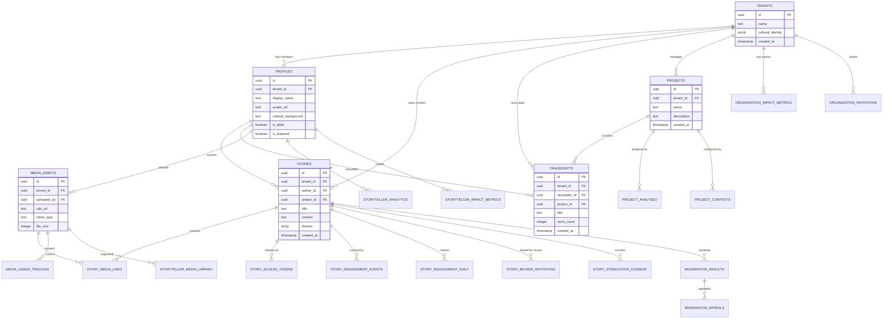
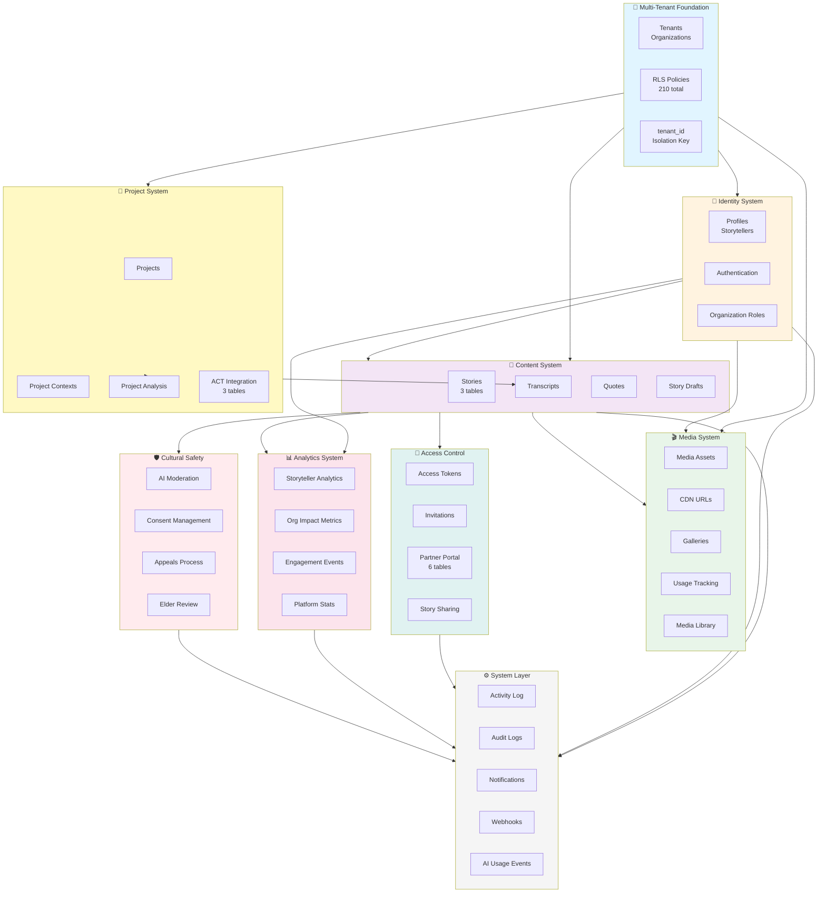
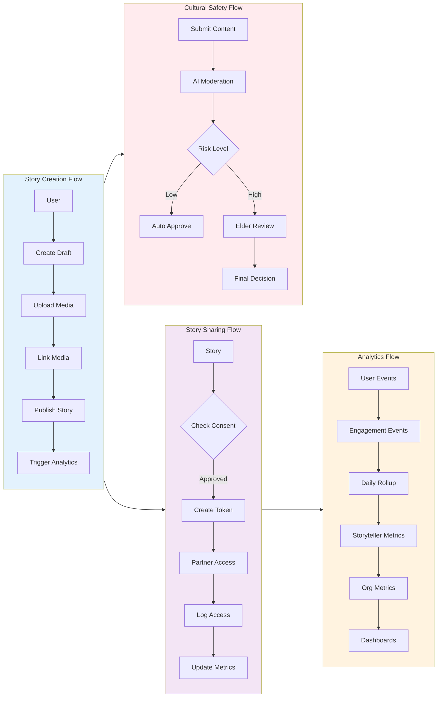
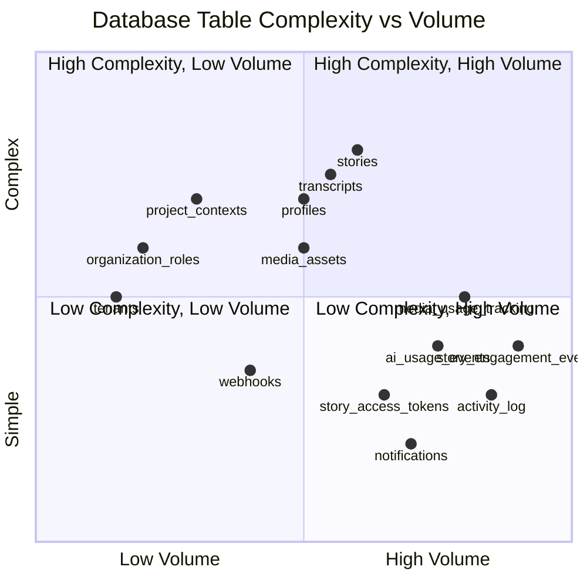
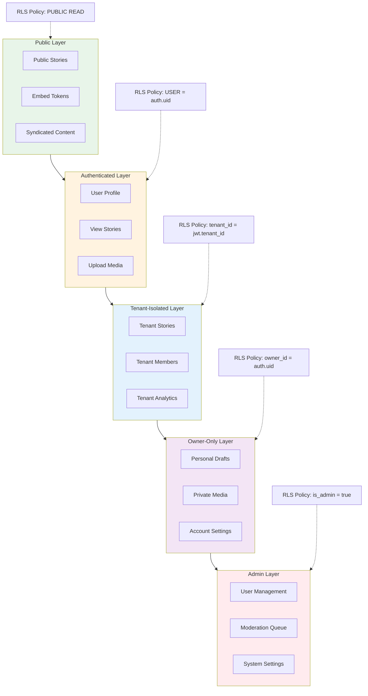
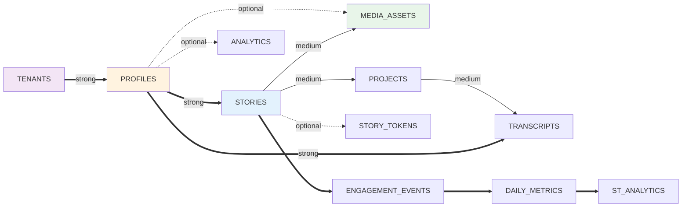
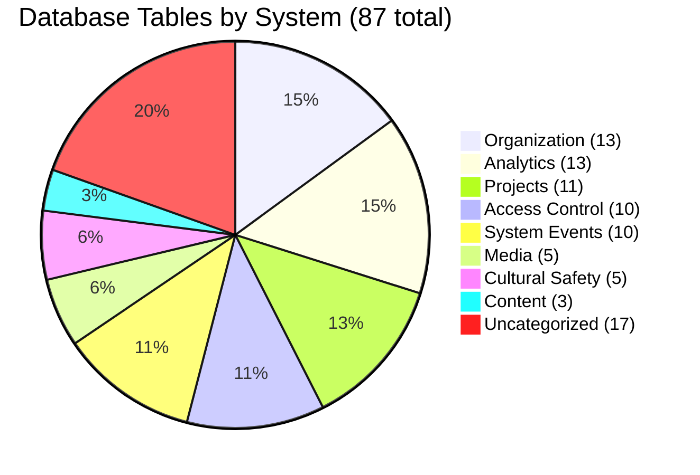
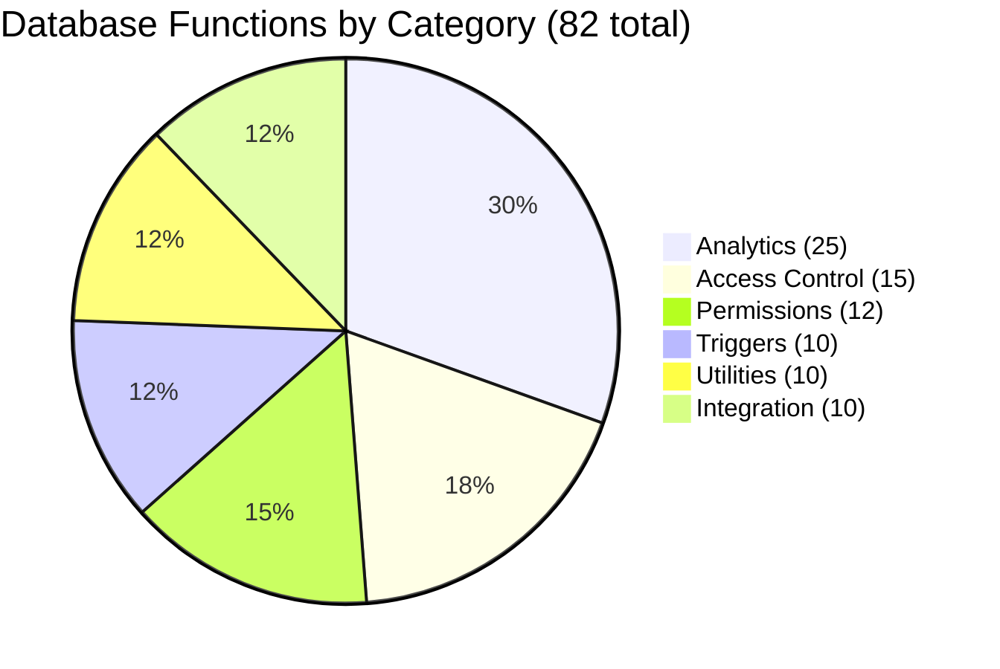

# Database Visual Diagrams

## 📊 Complete Entity Relationship Diagram

## 🏗️ System Architecture Diagram

## 🔄 Data Flow Diagram

## 📈 Table Size & Complexity Chart

## 🎯 Security Layers Diagram

## 🔗 Relationship Strength Map

## 📊 Table Count by System

## 🚀 Function Categories

## 📋 How to View These Diagrams

### In GitHub/GitLab
These Mermaid diagrams render automatically in:
- GitHub README/markdown files
- GitLab documentation
- Many markdown editors

### In VS Code
1. Install "Markdown Preview Mermaid Support" extension
2. Open this file
3. Press `Cmd+Shift+V` (Mac) or `Ctrl+Shift+V` (Windows)

### Online Viewers
- [Mermaid Live Editor](https://mermaid.live)
- Copy any diagram code block and paste

### Export as Image
1. Open in Mermaid Live Editor
2. Click "Export" → PNG/SVG
3. Save for presentations/docs

---

**Next**: See [INTERACTIVE_DIAGRAM.html](./INTERACTIVE_DIAGRAM.html) for clickable visualization!
